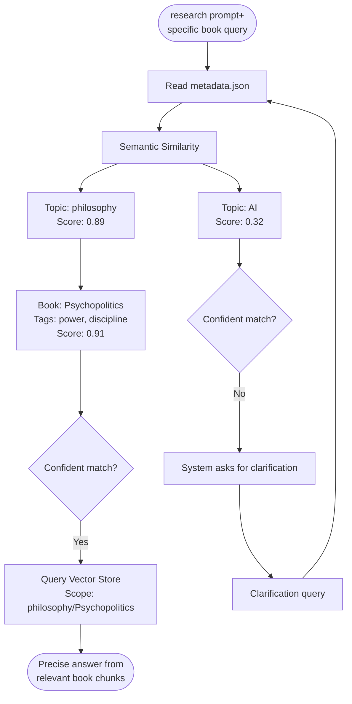

# Personal Library MCP

> A BYOB (Bring Your Own Books) local MCP so you can consult your library as you build your projects.

> All local (books, embedding models, database). [Connect with your favorite AI provider](#5-ai-provider-integration) and [ask away](#4-usage)

## Possible topics

- ⚖️ **Compliance**: collect all compliance and regulation manuals to test a new idea the proper way
- 🔧 **Troubleshooting**: move all your home devices and appliances' instruction manuals + warranties, ask troubleshooting questions
- 🌱 **Garden**: permaculture, indigenous plant guides, water management books to redesign your garden with less trial-and-error
- 🎸 **Music/Hobby**: wanna try a new hobby but have no idea of scope? collect authoritative books in the field you wanna learn, and reduce your confusion by asking freely questions
- 🎮 **Game Dev**: design patterns, procedural generation, narrative theory—query mid-project to find exactly which book explained that algorithm
- 🌍 **Field Research**: anthropology, ethnography, linguistics—entire library indexed locally, works offline for weeks in remote locations
- 💼 **Professional**: legal texts, industry whitepapers, case studies—cite exact sources during audits or client presentations
- 💪 **Health & Fitness**: training programs, nutrition guides, sports science—get grounded advice without influence rabbit holes

---

## How it works



---

## Installation

### Clone this repo

### 1. Install Python 3.11 or higher

- macOS`brew install python@3.11`
- Ubuntu/Debian `sudo apt install python3.11`
- Windows [Download from python.org](https://www.python.org/downloads/)
- Verify: `python3.11 --version`

### 2. Setup

1. Run setup script: `bash ./scripts/setup.sh`
   - Installs Python dependencies
   - Downloads local embedding model (all-MiniLM-L6-v2, ~90MB)
   - Model saved in `models/` directory (not tracked by git)

### 3. BYOB (Bring Your Own Books)

1. Add your books to `books/TOPICNAME/*.epub`
   - Exactly 1 folder level below `books/`
   - `.epub` and `.pdf`
   - Each folder is a topic
2. Generate metadata: `bash python3.11 scripts/generate_metadata.py`
3. Build index (includes auto-partitioning): `bash python3.11 scripts/indexer.py`
   - Creates vector store in `storage/`
   - Auto-partitions by topic for MCP lazy-loading
   - ~90MB for 34 books (local embeddings)
4. Test: `bash python3.11 scripts/query_partitioned.py "what books discuss AI ethics?" --topic ai`

**Folder structure:**

```
books/
├── topic_a/
│   ├── book1.epub
│   └── book2.pdf
├── topic_b/
│   └── book3.epub
```

### 4. Usage

- Use [/research prompt](https://github.com/nonlinear/personal-library/blob/main/.github/prompts/research.prompt.md) to consult Personal Library MCP on your AI conversations
- Make sure to specify topic or book name in your question. MCP will try to disambiguate based on metadata tags but the more focused the search, the better the results
- Without `/research`, your AI uses general knowledge. With it, you get precise citations from your library
- example 1: "`/research` what does Bogdanov say about Mars in Molecular Red?"
- example 2: "`/research` in my anthropocene books, what are the main critiques of geoengineering?"
- example 3: "`/research` what tarot spreads work best for decision-making under uncertainty?"

---

### 5. AI Provider Integration

The Personal Library MCP is **provider-agnostic**. Pick your favorite AI environment:

| Provider           | Status          | Notes                                                                                                                                                                                                                                                                       |
| ------------------ | --------------- | --------------------------------------------------------------------------------------------------------------------------------------------------------------------------------------------------------------------------------------------------------------------------- |
| **Terminal**       | ✅ Ready        | `python3.11 scripts/query_partitioned.py "your question" --topic ai`                                                                                                                                                                                                        |
| **VS Code**        | ✅ Ready        | Install [.vsix extension](https://github.com/nonlinear/personal-library/raw/main/.vscode/extensions/personal-library-mcp/personal-library-mcp-latest.vsix) + [/research prompt](https://github.com/nonlinear/personal-library/blob/main/.github/prompts/research.prompt.md) |
| **Claude Desktop** | 🤝 Collaborate? | Add to `~/Library/Application Support/Claude/claude_desktop_config.json` ([Personal Library signal group](https://signal.group/#CjQKIKD7zJjxP9sryI9vE5ATQZVqYsWGN_3yYURA5giGogh3EhAWfvK2Fw_kaFtt-MQ6Jlp8))                                                                  |
| **OpenAI API**     | 🤝 Collaborate? | Function calling wrapper needed ([Personal Library signal group](https://signal.group/#CjQKIKD7zJjxP9sryI9vE5ATQZVqYsWGN_3yYURA5giGogh3EhAWfvK2Fw_kaFtt-MQ6Jlp8))                                                                                                           |
| **LM Studio**      | 🤝 Collaborate? | Local model + MCP bridge ([Personal Library signal group](https://signal.group/#CjQKIKD7zJjxP9sryI9vE5ATQZVqYsWGN_3yYURA5giGogh3EhAWfvK2Fw_kaFtt-MQ6Jlp8))                                                                                                                  |
| **OpenWebUI**      | 🤝 Collaborate? | Custom tool integration ([Personal Library signal group](https://signal.group/#CjQKIKD7zJjxP9sryI9vE5ATQZVqYsWGN_3yYURA5giGogh3EhAWfvK2Fw_kaFtt-MQ6Jlp8))                                                                                                                   |

> 💡 **Want to add your idea?** Join [Personal Library signal group](https://signal.group/#CjQKIKD7zJjxP9sryI9vE5ATQZVqYsWGN_3yYURA5giGogh3EhAWfvK2Fw_kaFtt-MQ6Jlp8) and share your setup!

---

---

---

## Project progress roadmap

> 🤖🚨 FOR AI: Always check this section before starting any update on project. It tracks what's done and what's next.

### Foundation ✅ (COMPLETE)

- [x] `metadata.json` generation (`scripts/generate_metadata.py`)
- [x] LlamaIndex vector store setup
- [x] Local embedding model (sentence-transformers/all-MiniLM-L6-v2, 384-dim)
  - [x] Model cached in `models/` (90MB, not tracked by git)
  - [x] Zero API keys required
  - [x] Fully offline operation
- [x] CLI query tool (`scripts/query_partitioned.py`)
- [x] MCP server with 3 tools (query_library, list_topics, list_books)
- [x] Metadata-first query routing
- [x] Topic-partitioned storage (FAISS + pickle per topic)
- [x] Auto-partitioning integrated in `indexer.py`

### Phase 1: Database Optimization ✅ (COMPLETE)

**Problem**: `storage/docstore.json` (17MB) causes 30s MCP startup delay + Gemini API dependency

**Solution Implemented: Topic-Based Lazy Loading + Local Embeddings** 🎉

- [x] **Migrated to local embeddings** (Jan 15, 2026)
  - [x] Replaced Gemini (768-dim) → sentence-transformers (384-dim)
  - [x] Model stored in `models/` (90MB, gitignored)
  - [x] Zero API keys required - fully offline
  - [x] Updated: `indexer.py`, `query_partitioned.py`, `setup.sh`
  - [x] Removed: `.env` requirement, API key docs
- [x] Created `scripts/partition_storage.py`
- [x] **Integrated auto-partitioning in `indexer.py`** (no manual step)
- [x] Split storage into 12 topic-specific directories (automated)
- [x] Created `scripts/mcp_server_lazy.py`
  - [x] Loads ONLY `metadata.json` (19KB) on startup → **instant** (<100ms)
  - [x] Lazy-loads topics on first query (~2s per topic)
  - [x] Topic caching prevents reload
- [x] Binary format (pickle) for faster deserialization

### Phase 2: Delta Indexing 🔶 (PARTIAL)

**Infrastructure Complete, Automation Pending**

**✅ Done:**

- [x] Topic-partitioned storage (can reindex individual topics)
- [x] Metadata tracking (books/ → metadata.json)
- [x] Manual topic reindexing capability

**❌ Pending:**

- [ ] `scripts/update_delta.py` - automated change detection
  - [ ] Compare `books/` filesystem vs `metadata.json`
  - [ ] Identify deltas (added/removed/modified books)
  - [ ] Auto-reindex only affected topic directories
  - [ ] Incremental metadata.json updates
- [ ] CLI command: `python3.11 scripts/update_delta.py`
- [ ] Performance benchmarks (delta vs full reindex)

**Current workaround**: Manual full reindex (`python3.11 scripts/indexer.py`)

### Phase 3: Provider Integration 🔶 (PARTIAL)

**Core MCP Complete, Community Integrations Pending**

**✅ Done:**

- [x] Created `scripts/mcp_server_lazy.py` (provider-agnostic)
- [x] Lazy-loading architecture (instant startup)
- [x] Terminal client working
- [x] VS Code integration (MCP + /research prompt)
- [x] Auto-rebuild on missing indices
- [x] Consolidated storage (books/ only)

**🤝 Community Contributions Needed:**

- [ ] Claude Desktop config example
- [ ] OpenAI function calling wrapper
- [ ] LM Studio integration guide
- [ ] OpenWebUI custom tool
- [ ] Provider comparison benchmarks
- [ ] Integration testing across providers

### Phase 4: Automation & Advanced Features ❌ (NOT STARTED)

**Goal**: Zero-friction daily usage across all providers

**❌ All Pending:**

- [ ] **Filesystem watcher (`watchdog`)**
  - [ ] Monitor `books/` for file changes
  - [ ] Auto-regenerate `metadata.json`
  - [ ] Auto-reindex affected topics (uses Phase 2 delta logic)
  - [ ] Background indexing with progress indicator
  - [ ] Debounce mechanism
- [ ] **PDF support**
  - [ ] PDF text extraction (PyPDF2/pdfplumber)
  - [ ] PDF embedding pipeline
  - [ ] Update metadata schema
  - [ ] Test mixed EPUB/PDF libraries

### Future Enhancements

**Local Embedding Models** ✅ (COMPLETE):

- [x] Sentence Transformers (`all-MiniLM-L6-v2`)
  - Pros: Free, fast, offline, 384-dim
  - Model cached in `models/` (90MB)
- [ ] Test BGE embeddings (e.g., `BAAI/bge-small-en-v1.5`)
  - Pros: Better quality, still local, 384-dim
  - Cons: Larger model size
- [ ] Make embedding model swappable (config-based)

**Other Enhancements**:

- [ ] **Clean up folder structure**
  - [ ] Reorganize into 2 top-level folders: `books/` and one for everything else
  - [ ] Update all scripts to handle new structure
  - [ ] Test indexer, metadata generation, MCP server
  - [ ] Update documentation with new structure
  - [ ] Requires careful testing - breaking change
- [ ] PDF support (currently EPUB only)
- [ ] Image extraction and indexing from books
- [ ] Response caching for repeated queries
- [ ] Clarification prompts when query is ambiguous
- [ ] Threading/multiprocessing for faster indexing
- [ ] Terminal client (standalone, non-MCP)
- [ ] API documentation
- [ ] Performance benchmarks documentation
- [ ] **Deep linking to search results** ([concept](https://nonlinear.nyc/ideas/search-path))
  - [ ] Research EPUB/PDF viewers with URI scheme support
  - [ ] Provider-specific citation formats (VS Code pills, terminal hyperlinks, etc.)
  - [ ] Format: `viewer://file=path&search=query`
  - [ ] One-click navigation from citations to exact location in book
  - [ ] Integration with MCP response format
