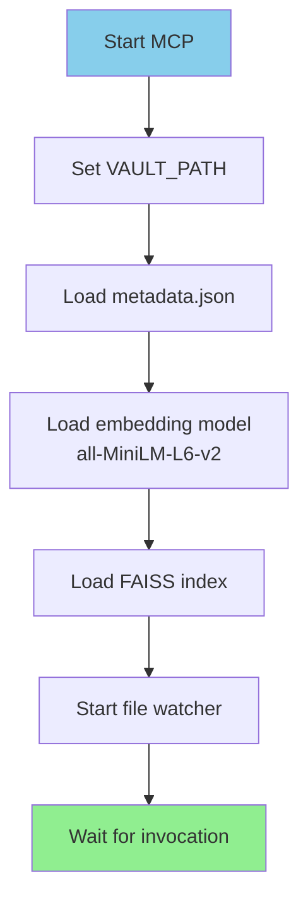
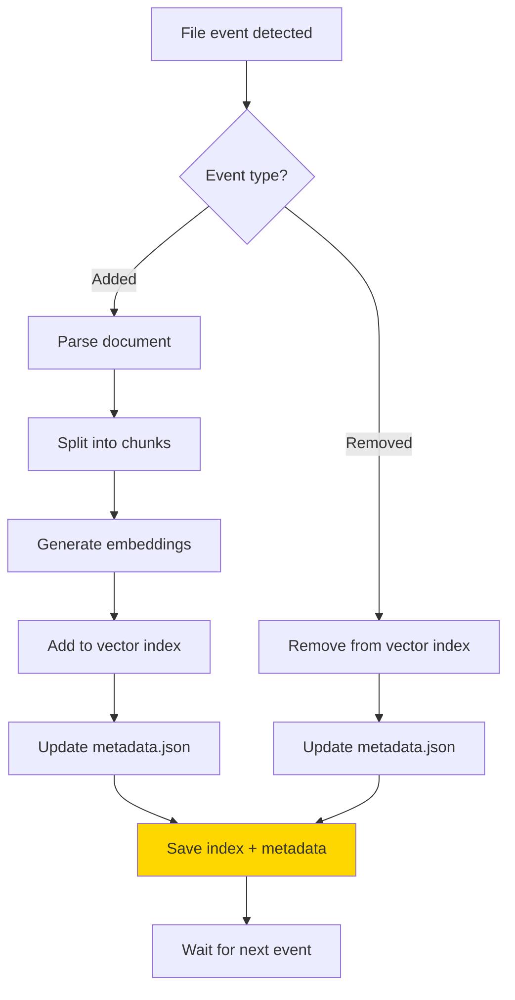
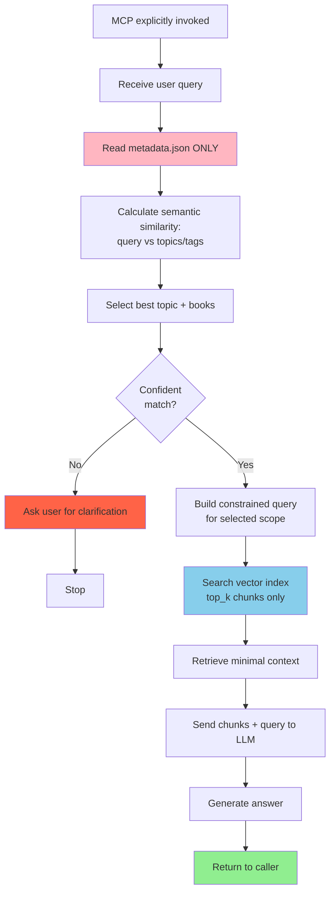
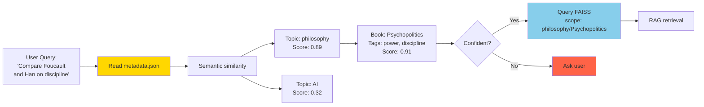

# Personal Library MCP

**Local, offline-first RAG system for personal book libraries**

A semantic navigation system for EPUB/PDF collections. Designed for speed, control, and zero cloud dependencies.

---

## Core Principles

**Every millisecond matters.**

This system is a **semantic orientation tool**, not a conversational assistant.

- **Map ≠ Territory**: Uses a single metadata file for navigation, not content replication
- **Explicit invocation only**: No automatic exploration or unsolicited responses
- **Delta indexing**: Only reindexes what changed
- **Client-agnostic backend**: VS Code is just one possible interface

---

## Architecture

### Vault Structure

```
books/
├── topic_a/
│   ├── book1.epub
│   └── book2.pdf
├── topic_b/
│   └── book3.epub
```

**Rules:**

- Exactly 1 folder level below `books/`
- Each folder = 1 topic
- Only EPUBs and PDFs inside

### Technology Stack

| Component     | Choice                 | Why                             |
| ------------- | ---------------------- | ------------------------------- |
| Engine        | Python 3.11            | Homebrew-managed, local control |
| RAG Framework | LlamaIndex             | Efficient local indexing        |
| Embeddings    | `all-MiniLM-L6-v2`     | 384-dim, fast, open source      |
| Vector Store  | FAISS                  | Local, no network calls         |
| File Watching | `watchdog`             | Delta detection                 |
| Metadata      | Single `metadata.json` | Fast navigation map             |

---

## The Map: `metadata.json`

**Purpose:** Minimal abstraction for rapid AI decision-making.

**Not:**

- A content copy
- A search index
- A documentation system

**Analogy:** Subway map, not geographic map.

### Structure

```json
{
  "topics": [
    {
      "id": "fitness",
      "label": "Fitness & Training",
      "description": "Physical training, strength, conditioning",
      "books": [
        {
          "id": "starting_strength",
          "title": "Starting Strength",
          "author": "Mark Rippetoe",
          "year": 2011,
          "tags": ["barbell", "strength", "programming"]
        }
      ]
    }
  ]
}
```

**Design decisions:**

- Tags exist only on books (semantic signal)
- Topics have: name + short description
- No text duplication
- Every field serves navigation

---

## System Pseudocode

### 1. MCP Initialization



**Rule:** MCP is passive. Nothing happens until explicitly called.

---

### 2. File Watching (Delta-Based)



**Rule:** Never reindex everything. Only delta changes.

---

### 3. Query Flow



---

### 4. Navigation Logic (Map ≠ Territory)



**Key insight:** The map guides navigation. Territory is only accessed after direction is clear.

---

## Query Flow Principles

**Steps:**

1. User asks a question
2. AI reads **only** `metadata.json`
3. AI calculates semantic similarity (query ↔ topics/tags)
4. AI selects best topic + books
5. **Only then** does vector store query execute
6. If unclear → request clarification

**Never:**

- Explore the vault without direction
- Load large contexts speculatively
- Attempt "smart" auto-discovery
- Make guesses when uncertain

---

## File Watching & Indexing

**Trigger:** Book added/removed from vault

**Process:**

1. `watchdog` detects filesystem change
2. Extract delta (new/removed files only)
3. Update embeddings (incremental)
4. Update `metadata.json`
5. Persist to FAISS

**No full reindexing unless explicitly requested.**

---

## What This System Is Not

- ❌ Not a chat interface
- ❌ Not cloud-dependent
- ❌ Not a general-purpose MCP
- ❌ Not trying to be "smart" beyond navigation

**It is:**

- ✅ A navigation layer for your books
- ✅ A semantic index with minimal latency
- ✅ A local-first, privacy-preserving tool

---

## Development Environment

### Python

**Always use Homebrew Python 3.11:**

```bash
/opt/homebrew/bin/python3.11 -m pip install <package>
/opt/homebrew/bin/python3.11 script.py
```

**Never use:**

- `python3`, `python`, `pip`, `pip3` without full path
- Virtual environments (venv, conda, etc.)
- System Python

### Environment Variables

All secrets in `.env`:

```bash
GEMINI_API_KEY=your_key_here
```

**Never commit `.env` or hardcode keys.**

---

## Roadmap

### Phase 1: Core Infrastructure

- [ ] Implement `metadata.json` generation
- [ ] File watcher with delta detection
- [ ] FAISS vector store setup
- [ ] Local embedding pipeline (`all-MiniLM-L6-v2`)

### Phase 2: Query System

- [ ] Metadata-first query routing
- [ ] Clarification prompts when ambiguous
- [ ] RAG retrieval from selected topics/books
- [ ] Response caching

### Phase 3: Optimization

- [ ] Threading/multiprocessing
- [ ] Index persistence optimization
- [ ] PDF support
- [ ] Image extraction and indexing

### Phase 4: Clients

- [ ] VS Code extension (thin client)
- [ ] Terminal client
- [ ] API documentation

---

## For AI Agents

When working on this codebase:

1. **Read `metadata.json` first** before any RAG query
2. **Never explore the vault** without explicit instruction
3. **Use Homebrew Python 3.11** for all operations
4. **Respect the map-territory distinction**
5. **Optimize for latency** over comprehensiveness

This is a navigation system, not a knowledge base.
