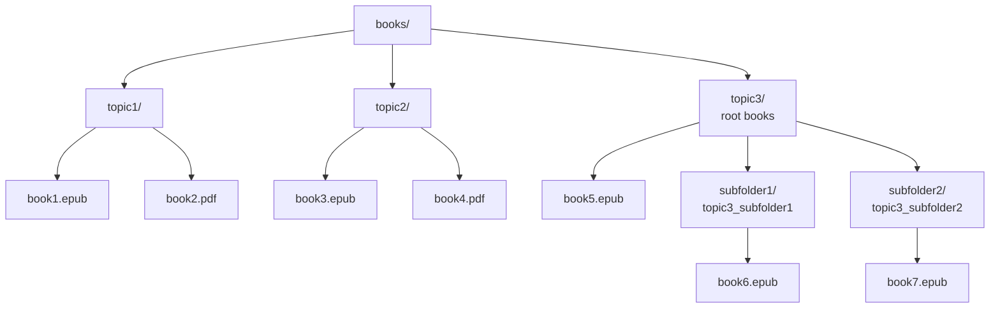

# Librarian MCP

> A BYOB (Bring Your Own Books) local MCP so you can consult your library as you build your projects.

> All local (books, embedding models, database). Connect with your favorite AI provider and [ask away](#Usage)

---

| Possible uses               | Description                                                                                                                                                     |
| :-------------------------- | :-------------------------------------------------------------------------------------------------------------------------------------------------------------- |
| ⚖️&nbsp;**Compliance**      | Collect all compliance and regulation manuals to test a new idea the proper way                                                                                 |
| 🔧&nbsp;**Home&nbsp;fixes** | Move all your home devices and appliances' instruction manuals + warranties, ask troubleshooting questions                                                      |
| 🌱&nbsp;**Gardening**       | Permaculture, indigenous plant guides, water management books to redesign your garden with less trial-and-error                                                 |
| 🎸&nbsp;**New&nbsp;hobby**  | Wanna try a new hobby but have no idea of scope? Collect authoritative books in the field you wanna learn, and reduce your confusion by asking freely questions |
| 🎮&nbsp;**Game&nbsp;Dev**   | Design patterns, procedural generation, narrative theory—query mid-project to find exactly which book explained that algorithm                                  |
| 🌍&nbsp;**Academic**        | Anthropology, ethnography, linguistics—entire library indexed locally, works offline for weeks in remote locations                                              |
| 💼&nbsp;**Professional**    | Legal texts, industry whitepapers, case studies—cite exact sources during audits or client presentations                                                        |
| 💪&nbsp;**Fitness**         | Training programs, nutrition guides, sports science—get grounded advice without influence rabbit holes                                                          |

---

## Installation

1. **Clone this repo**
2. **[Install Python](https://www.python.org/downloads/)**: 3.11 or higher
3. **Run setup**: `bash ./engine/scripts/setup.sh`
   - Installs dependencies
   - Downloads embedding model: [BAAI/bge-small-en-v1.5](https://huggingface.co/BAAI/bge-small-en-v1.5) (~130MB, 384-dim)
   - Saved in `engine/models/` (git-ignored)
4. **BYOB**: Bring Your Own Books
   - Create folders in `books/` (one per topic)
   - Add `.epub` and `.pdf` files
   - **Optional:** Use subfolders for grouping
     - Example: `books/cybersecurity/strategy/` → `cybersecurity_strategy`
5. **Generate metadata**: `python3.11 engine/scripts/generate_metadata.py`
6. **Build indices**:
   - Full: `python3.11 engine/scripts/indexer.py`
   - Per-topic: `python3.11 engine/scripts/reindex_topic.py <topic-id>`
7. **Test**: `python3.11 engine/scripts/research.py "AI ethics?" --topic ai`



---

## Usage

<!-- ### via [openclaw](https://openclaw.ai)

```bash
clawdhub install librarian
```

### by prompt -->

**Use `/research` prompt** to consult Librarian MCP on your AI conversations (see [.github/prompts/research.prompt.md](.github/prompts/research.prompt.md))

Make sure to **specify topic or book** in your question. MCP will try to disambiguate based on metadata tags but the more focused the search, the better the results

**Example 1**: "`/research` what does Bogdanov say about Mars in Molecular Red?"

**Example 2**: "`/research` in my anthropocene books, what are the main critiques of geoengineering?"

**Example 3**: "`/research` what tarot spreads work best for decision-making under uncertainty?"

**Troubleshooting:** Books that failed to index (corrupted files, unsupported formats) go silently to `backstage/FAILED.md`

> 👉 Without `/research` your AI uses general knowledge. With it you get precise citations from your library

---

## How it works


---


> 🤖
>
> This project follows [backstage protocol](https://github.com/nonlinear/backstage) v0.3.4
>
> [README](README.md) 👏 [ROADMAP](backstage/ROADMAP.md) 👏 [CHANGELOG](backstage/CHANGELOG.md) 👏 checks: [local](backstage/checks/local/) <sup>4</sup>, [global](backstage/checks/global/) <sup>28</sup>
>
> 🤖


```mermaid
graph LR
    A[📋 v0.16.0 📦 Unified Indexing Pipeline | [notes](epic-notes/v0.16.0-unified-indexing.md)]
    B[📋 v0.17.0 🔀 Multi-Scope Queries | [notes](epic-notes/v0.17.0-multi-scope.md)]
    A --> B
    C[📋 v0.15.0 🎯 Skill as Protocol | [notes](epic-notes/v0.15.0-skill-protocol.md) | [translation](epic-notes/v0.15.0-skill-translation.md) | [best-practices](epic-notes/v0.15.0-best-practices.md)]
    B --> C
    D[📋 v1.2.1 ✅ Research Enhancement | [notes](epic-notes/v1.2.1/)]
    C --> D
```


