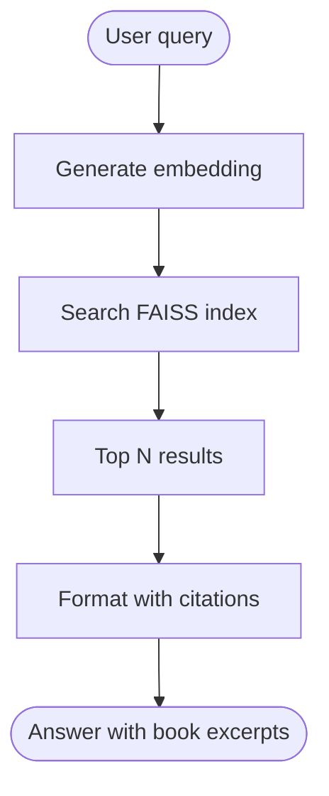

# Librarian

> A BYOB (Bring Your Own Books) semantic search over your personal library.

> All local (books, embedding models, database). Connect with your favorite AI provider and ask away.

---

| Possible uses               | Description                                                                                                                                                     |
| :-------------------------- | :-------------------------------------------------------------------------------------------------------------------------------------------------------------- |
| ⚖️&nbsp;**Compliance**      | Collect all compliance and regulation manuals to test a new idea the proper way                                                                                 |
| 🔧&nbsp;**Home&nbsp;fixes** | Move all your home devices and appliances' instruction manuals + warranties, ask troubleshooting questions                                                      |
| 🌱&nbsp;**Gardening**       | Permaculture, indigenous plant guides, water management books to redesign your garden with less trial-and-error                                                 |
| 🎸&nbsp;**New&nbsp;hobby**  | Wanna try a new hobby but have no idea of scope? Collect authoritative books in the field you wanna learn, and reduce your confusion by asking freely questions |
| 🎮&nbsp;**Game&nbsp;Dev**   | Design patterns, procedural generation, narrative theory—query mid-project to find exactly which book explained that algorithm                                  |
| 🌍&nbsp;**Academic**        | Anthropology, ethnography, linguistics—entire library indexed locally, works offline for weeks in remote locations                                              |
| 💼&nbsp;**Professional**    | Legal texts, industry whitepapers, case studies—cite exact sources during audits or client presentations                                                        |
| 💪&nbsp;**Fitness**         | Training programs, nutrition guides, sports science—get grounded advice without influence rabbit holes                                                          |

---

## Installation

### Prerequisites
- **Docker** & **Docker Compose** ([install here](https://docs.docker.com/get-docker/))
- **Docker Desktop Settings:**
  - Memory: **16GB minimum** (Settings → Resources → Memory)
  - Default 7.6GB is insufficient for indexing
- **Disk space:** ~2GB (dependencies + models)
- **macOS/Linux** (Windows: use WSL2)

### Quick Start

```bash
# 1. Clone the repo
git clone https://github.com/nonlinear/librarian.git
cd librarian

# 2. Add your books
# Copy EPUB/PDF files to books/ folder
cp ~/Downloads/*.epub books/

# OR use the included test books
cp test-books/*.epub books/

# 3. Start the container
docker-compose up -d

# This will:
# - Build Docker image (~5-10 min first time)
# - Download embedding model (~130MB, cached for future runs)
# - Index your books (~2-5 min per 100 books)

# 4. Check logs (optional - see indexing progress)
docker logs librarian -f
# Press Ctrl+C to exit logs

# 5. Test a query
docker exec librarian python3 /app/engine/scripts/faiss_search.py "wonderland rabbit"
```

**Expected output:**
```
Found 5 results:
1. Alice's Adventures in Wonderland (Lewis Carroll) - Score: 0.89
   "The rabbit-hole went straight on like a tunnel for some way..."

2. Alice's Adventures in Wonderland (Lewis Carroll) - Score: 0.85
   "...White Rabbit with pink eyes ran close by her..."
```

### What Happens on First Run

1. **Docker build** (~5-10 min)
   - Installs Python 3.11
   - Installs dependencies (torch, sentence-transformers, FAISS, etc.)
   - Downloads ~1GB of libraries

2. **Model download** (~1 min)
   - Downloads BAAI/bge-small-en-v1.5 embedding model (~130MB)
   - Cached in `engine/models/` for future runs

3. **Indexing** (~2-5 min per 100 books)
   - Extracts text from EPUB/PDF
   - Generates embeddings
   - Builds FAISS index

**After first run:** Adding new books takes <10s (incremental indexing).

---

## Usage

### Command Line

```bash
docker exec librarian python3 /app/engine/scripts/faiss_search.py "design systems"
```

### AI Assistant Integration

**Two options:**

1. **Full MCP integration** → See [SKILL.md](SKILL.md)
   - Claude Desktop / OpenClaw
   - Complete setup guide
   - Output format rules

2. **Quick prompt** → See [skill-prompt.md](skill-prompt.md)
   - Copy-paste into custom instructions
   - No installation needed
   - Works with any AI assistant

**Example queries:**
- "What do I have about design systems?"
- "Find books on mutual aid and care"
- "How do taxonomies differ from folksonomies?"

> 👉 Without MCP/prompt your AI uses general knowledge. With it you get precise citations from your library

---

## How it works


```mermaid
graph TD
    QUERY([User query]) --> EMBED[Generate embedding]
    EMBED --> FAISS[Search FAISS index]
    FAISS --> RESULTS[Top N results]
    RESULTS --> FORMAT[Format with citations]
    FORMAT --> ANSWER([Answer with book excerpts])
```

**Architecture:**
- **Indexer:** Extracts text from EPUB/PDF → chunks → embeddings
- **FAISS:** Vector similarity search (BAAI/bge-small-en-v1.5, 384-dim)
- **Incremental:** Only processes new/changed books (O(Δ))
- **Watcher:** Auto-detects new files (<10s reindex)
- **MCP:** Claude Desktop / OpenClaw integration

---

## Features

✅ **Semantic search** (not just keywords)  
✅ **Incremental indexing** (add books → auto-reindex in <10s)  
✅ **File watcher** (drop book in folder → indexed automatically)  
✅ **MCP server** (Claude Desktop / OpenClaw integration)  
✅ **EPUB reader** (deep linking to exact paragraphs)  
✅ **Stable IDs** (content-addressed, survives renames)  
✅ **All local** (no API calls, works offline)

---

## Performance

| Library Size | Index Time | Query Time | Disk Space |
|--------------|------------|------------|------------|
| 100 books    | 2-5 min    | <0.3s      | ~100 MB    |
| 500 books    | 10-15 min  | <0.5s      | ~400 MB    |
| 1000 books   | 20-30 min  | <0.7s      | ~800 MB    |

**After initial index:** Adding 1 book takes <10s.

---

## Test Books

Included in `test-books/`:
- Alice in Wonderland (Lewis Carroll)
- Frankenstein (Mary Shelley)
- Moby Dick (Herman Melville)

All public domain (Project Gutenberg).

---

## Utilities

### AI Assistant Integration
- **[SKILL.md](SKILL.md)** - Full MCP integration guide
- **[skill-prompt.md](skill-prompt.md)** - Quick copy-paste prompt

---

## Troubleshooting

### First Install Issues

#### Container crashes during indexing (code 137)
**Cause:** Docker out of memory (OOM)

**Fix:**
1. Open **Docker Desktop**
2. Go to **Settings → Resources**
3. Increase **Memory** to **16GB** (minimum)
4. Click **Apply & Restart**
5. Try again: `docker-compose up -d`

**Why:** Embedding model + torch + indexing uses ~8-12GB during first run

#### Docker build taking too long
**Normal:** First build downloads ~1-2GB of dependencies (torch, CUDA libs, etc.)
**Time:** 5-15 minutes depending on internet speed
**Fix:** Be patient, it's cached for future runs

#### Container exits immediately
```bash
# Check logs
docker logs librarian

# Common causes:
# 1. Port 8088 already in use → change in docker-compose.yml
# 2. Out of memory → close other apps or increase Docker RAM
```

#### Model download fails
```bash
# Manual download inside container
docker exec -it librarian bash
python3 -c "from sentence_transformers import SentenceTransformer; SentenceTransformer('BAAI/bge-small-en-v1.5', cache_folder='/app/engine/models')"
exit

# Restart container
docker-compose restart
```

### Usage Issues

#### Indexing stuck
```bash
# Restart container
docker-compose restart

# Force reindex
docker exec librarian python3 /app/engine/scripts/indexer_v6.py
```

### No results for query
1. Check books indexed: `docker exec librarian cat /app/books/.index_state.json | jq .total_books`
2. Check FAISS loaded: `docker logs librarian | grep "FAISS loaded"`
3. Try broader terms

### Watcher not detecting new books
```bash
# Check watcher is running
docker logs librarian | grep "Watcher active"

# Restart watcher
docker-compose restart
```

---

## Community

Join the discussion:
- **Matrix:** [#librarian:matrix.org](https://matrix.to/#/#librarian:matrix.org) *(coming soon)*
- **Issues:** [GitHub Issues](https://github.com/nonlinear/librarian/issues)

---

## License

MIT License - see [LICENSE](LICENSE)

---

## Credits

- **[FAISS](https://github.com/facebookresearch/faiss):** Meta AI (vector search)
- **[Sentence Transformers](https://www.sbert.net/):** HuggingFace (embeddings)
- **[epub.js](https://github.com/futurepress/epub.js/):** FuturePress (EPUB rendering)
- **[FastAPI](https://fastapi.tiangolo.com/):** Sebastián Ramírez (web framework)

---

**Built by [Nonlinear Studio](https://nonlinear.nyc)**
