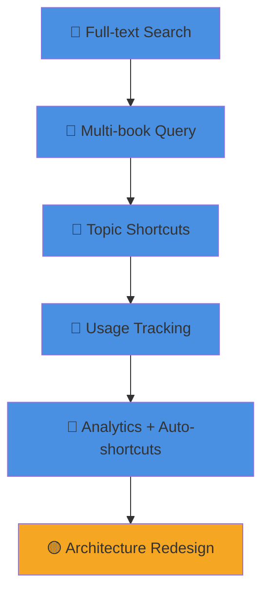

# LIBRARIAN ROADMAP

1️⃣ **Full-text Search:** EPUBs, PDFs, markdown via calibre indexing 
2️⃣ **Multi-book Query:** `-b "book1|book2"` syntax for scoped searches 
3️⃣ **Topic Shortcuts:** `-t magick_tarot` → auto-load preset book lists 
4️⃣ **Usage Tracking:** `--tracked` flag logs queries to `usage.jsonl` 
5️⃣ **Analytics + Auto-shortcuts:** Top 10 topics generate shortcuts.json 
6️⃣ 📝 **Architecture Redesign:** Core abstraction, indexing strategy, plugin system

---

## Current State (v1.0)

**How to use:**
1. **Research query:** `python3 ~/Documents/librarian/engine/scripts/research.py "query" -t topic --tracked`
2. **Topic shortcuts:** See `shortcuts.json` for available topics
3. **Analytics:** `python3 ~/Documents/librarian/analyze-usage.py` (view stats)
4. **Generate shortcuts:** `python3 ~/Documents/librarian/analyze-usage.py --shortcuts` (auto-update top 10)

**Files:**
- `~/Documents/librarian/usage.jsonl` - query logs (append-only)
- `~/Documents/librarian/shortcuts.json` - topic → books mapping
- `~/.openclaw/skills/librarian/SKILL.md` - full documentation

**Architecture:**
- Kavita (library management + reading)
- search.py (calibre-based indexing)
- research.py (unified CLI)
- Shortcuts system (topic → books mapping)

---

## Backlog

### 6️⃣ Architecture Design Exercise 📝

**Problem:** System grew organically, now has friction points:
- Multiple entry points (`search.py`, `research.py`, wrappers)
- Calibre dependency (heavyweight, slow indexing)
- PDF support issues (formatting breaks, tables unreadable)
- Shortcuts scattered (topics vs books vs queries)
- No clear plugin system for new sources

**Goal:** Re-architect for **clarity, speed, extensibility**

**Questions to answer:**
1. **Core abstraction:** What's the single mental model? (Document? Query? Source?)
2. **Indexing strategy:** Stick with calibre or switch? (ripgrep-all? custom indexer?)
3. **Plugin system:** How to add new sources? (web, notes, APIs)
4. **Query language:** Keep simple strings or support structured queries?
5. **Performance:** Pre-index vs on-demand search? Cache strategy?

**Next step:** Design doc → prototype → migrate

**Why backlog:** Current system works. Design exercise = >2min → needs dedicated time.

---

### 7️⃣ Design Architecture Diagram Exercise 📐

**Problem:** Skill protocol has two parts (extraction + presentation), but easy to skip presentation format when focusing on content.

**Goal:** Practice `design-architecture` skill end-to-end:
1. Apply EPGAR extraction (entities, processes, goals, etc.)
2. Follow 1️⃣2️⃣3️⃣ presentation format (mandatory, not optional)
3. Generate gray→red→yellow→blue diagram

**Test case:** Librarian architecture redesign (item #6 above)

**Success criteria:**
- Diagram follows skill format exactly
- All EPGAR elements captured
- Presentation = protocol-compliant

**Why backlog:** Meta-exercise to reinforce skill adherence. Not urgent, but valuable practice.

---

## Done

- ✅ Merge `research-tracked.sh` into `research.py --tracked`
- ✅ Deprecate redundant wrapper scripts
- ✅ Add usage analytics + shortcuts generation

---

**Philosophy:** Low metabolic cost, high agency. Every layer costs. Simplify or justify. de
