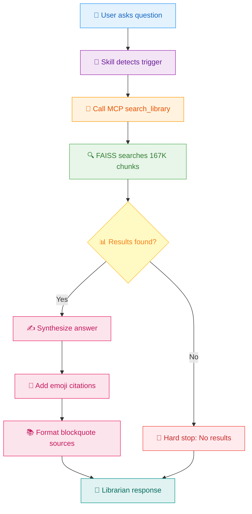
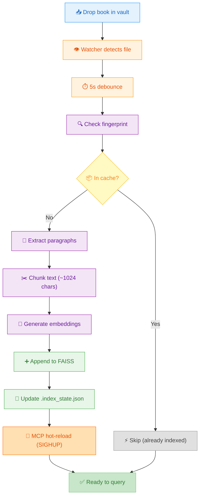
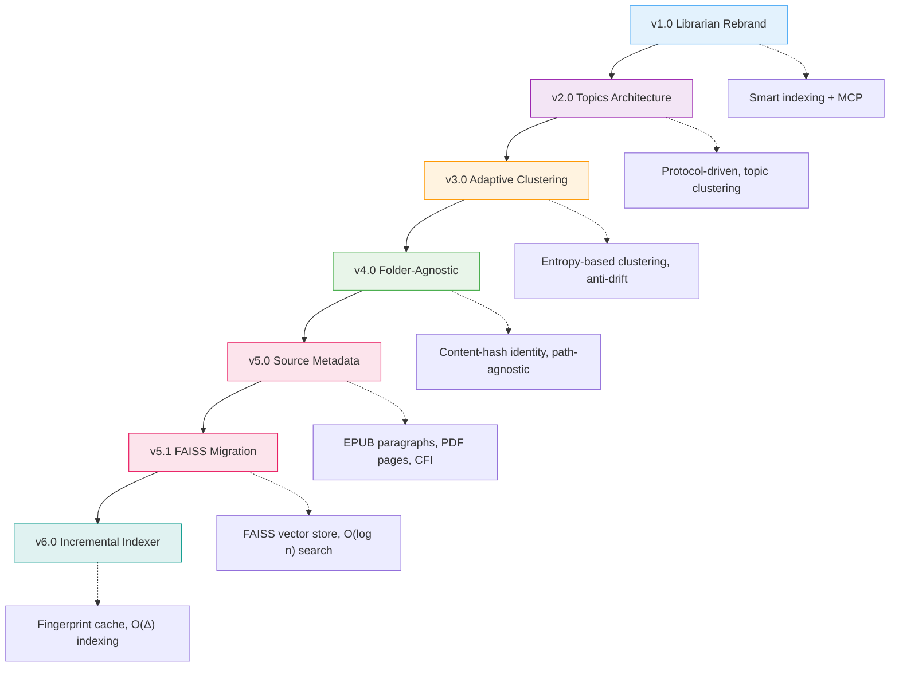

# Librarian: Semantic Book Search

Search 290+ indexed books using natural language. Returns citations with chapter/page locations.

**Architecture:** Skill → MCP Tool (`search_library`) → FAISS Search

---

## Protocol Flow

### Query Flow (Question → Answer)



**Timing:** ~1-2s total (sub-second search + synthesis)

---

### Indexing Flow (New Book → Ready)



**Timing:** 
- Cached (moved file): <1s
- New book: 5-10s (extract + embed + append)
- No restart needed ✅

---

## Trigger Detection

Activate when user query matches:

**Explicit:**
- "pesquisa [QUERY]" / "search [QUERY]"
- "consult books about [TOPIC]"
- "Librarian: [QUERY]"
- "Consulte livros sobre [CONCEPT]"

**Implicit:**
- "What does [AUTHOR] say about [TOPIC]?"
- "Find references to [CONCEPT]"
- "O que [LIVRO] diz sobre [ASSUNTO]?"

---

## Call MCP

```python
search_library(
    query: str,          # Natural language query
    k: int = 10,        # Number of results
    min_score: float    # Optional threshold (e.g., 0.7)
)
```

**Returns:**
```json
[
  {
    "text": "Full chunk text...",
    "book_title": "Design That Scales",
    "score": 0.812,
    "source": {
      "type": "epub",
      "spine_index": 11,
      "href": "xhtml/chapter1.xhtml",
      "paragraph_idx": 5
    }
  }
]
```

**Container:** `librarian` (always running on port 8088)

---

## Format Output

### Structure

1. **Synthesize answer** (coherent paragraphs, not just chunks)
2. **Inline emoji citations** (1️⃣ 2️⃣ 3️⃣)
3. **Blockquote sources** with locations
4. **Similarity stars** (⭐⭐⭐⭐⭐ 0.9+, ⭐⭐⭐⭐ 0.8+, ⭐⭐⭐ 0.7+)

### Source Format

**EPUB:** `Book Title, Chapter X (¶Y)`  
**PDF:** `Book Title, p.X`

### Example

**User:** "What does Graeber say about the origins of money?"

**Response:**

Graeber argues that money did NOT originate from barter. 1️⃣ Credit and debt systems came first — people tracked obligations before coins existed.

He traces debt to ancient Mesopotamia (~3500 BCE), where temple administrators recorded loans in cuneiform. 2️⃣ Coins appeared around 600 BCE in Lydia. 3️⃣

**Key insight:** Debt is older than money.

---

> **Fontes:**
>
> 1️⃣ Debt: The First 5000 Years (Graeber), p.21
>
> 2️⃣ Debt: The First 5000 Years (Graeber), p.40
>
> 3️⃣ Debt: The First 5000 Years (Graeber), p.89
>
> **Similarity:** ⭐⭐⭐⭐⭐ (0.95+ relevance)

**Note:** Reader not implemented (E036). Citations show location but aren't clickable.

---

## Hard Stops

When MCP fails, report exactly what happened:

- **No results** → "Não achei nada sobre [query]"
- **System error** → "Sistema quebrado"
- **MCP down** → "Serviço de busca indisponível"

**DO NOT:**
- ❌ Offer web search alternatives
- ❌ Hallucinate ("maybe the book says...")
- ❌ Apologize or frame as your failure

**Hard stop = success.** You detected system state and reported honestly.

---

## Troubleshooting

**No results but book exists:**
- Try broader terms
- Check if indexed (290 EPUBs, 303 PDFs pending)

**MCP not responding:**
```bash
docker ps | grep librarian
docker restart librarian
docker logs librarian --tail 50
```

---

## Technical Details

**Index:** 290 EPUBs, 167,767 chunks, 664MB  
**Search:** O(log n) ANN, <1s latency  
**Model:** BAAI/bge-small-en-v1.5 (384-dim)

**Files:**
- `/app/books/faiss.index` (245.8 MB)
- `/app/books/metadata.json` (418.0 MB)

---

## References

**Principle:**
```
SKILL = SOURCE OF TRUTH
Agent reads skill → follows instructions → accesses MCP
Never call MCP directly
```

**Related:**
- E027: Librarian MVP
- E034: Source Metadata
- E035: FAISS Migration

---

## Development History



**Key Evolution:**
- **v1-v2:** Topic-based semantic search
- **v3:** Attempted clustering (removed - premature structure)
- **v4:** Stable identity layer (move-safe)
- **v5:** Source metadata (chapter/page/¶)
- **v5.1:** FAISS production (69% size reduction)
- **v6:** Incremental indexing (epistemic anti-drift)

**Current State:** 290 EPUBs, 219K chunks, <1s search, <10s new book indexing

---

**Last updated:** 2026-05-06  
**Status:** ✅ Production (MCP v5 operational)
