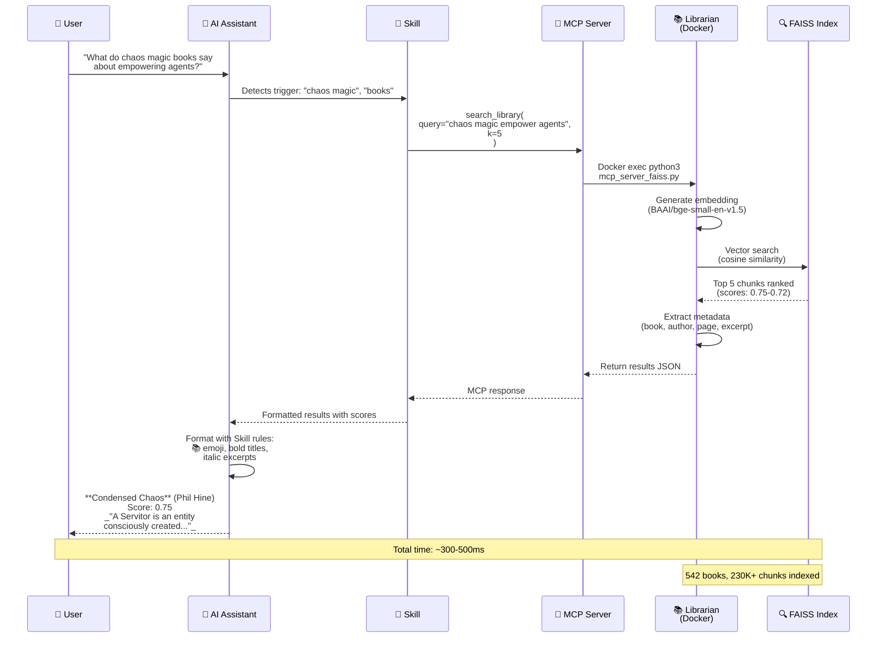

**Version:** v3.0.0 (Adaptive Knowledge Organization)  
**Status:** Production  
**MCP Server:** `librarian-mcp` (Docker)  
**Port:** 8766 (UI), stdio (MCP)

---

## Query Flow Example



**Real example flow:**

1. **User asks:** "What do chaos magic books say about empowering agents?"
2. **Skill triggers** on keywords: "chaos magic", "books"
3. **MCP call:** `search_library(query="chaos magic empower agents", k=5)`
4. **Librarian processes:**
   - Generates 384-dim embedding vector
   - Searches 230,487 indexed chunks via FAISS
   - Ranks by cosine similarity (scores 0-1)
   - Returns top 5 with metadata
5. **Response formatted** per Skill rules:
   - 📚 emoji markers
   - **Bold book titles**
   - _Italic excerpts_
   - Scores shown (0.75, 0.74, etc)
6. **User receives** grounded answer with exact sources

**Key technical details:**
- MCP uses **stdio** (not TCP port)
- Container: `docker exec -i librarian python3 /app/engine/scripts/mcp_server_faiss.py`
- Search: **semantic** (not keyword matching)
- Speed: <500ms typical query time

---

## v3 Features (2026-04-24)

### 1. Context-Aware Search

**Query includes conversation history:**
```python
context = [
    "We're discussing knowledge organization",
    "User asked about taxonomies vs folksonomies"
]

result = search_library(
    query="How do they differ?",
    context=context  # NEW in v3
)
```

**Effect:**
- Query embedding = 70% query + 30% context (weighted)
- Context decay: [0.5, 0.3, 0.2] (newest → oldest)
- Prevents query dilution

---

### 2. Entropy-Based Clustering

**System decides when to cluster:**
- **Low entropy** (avg similarity > 85%) → Single cluster mode
- **Medium entropy** (70-85%) → Clustering allowed
- **High entropy** (< 70%) → Clustering encouraged

**Effect:** No fake structure when diversity is low.

---

### 3. Dynamic Cluster Attribution (DCA)

**Results include WHY cluster was chosen:**
```markdown
📚 Cluster: Mutual Aid & Commons

Why this cluster:
- High semantic match (score: 0.82)
- Keyword overlap: cooperation, commons
- Context from conversation influenced selection
- Clear winner: significantly ahead of next cluster

---

Found 5 results:
1. **Mutual Aid: A Factor of Evolution** (Kropotkin, p. 23)
   ...
```

**Effect:** Explainable epistemic routing (not black-box).

---

### 4. Health Monitoring

**System self-monitors:**
- Fallback rate (< 30% healthy)
- Cluster concentration (< 40% healthy)
- Ambiguity rate (< 40% healthy)
- Mismatch rate (< 20% healthy)
- Score distributions

**Logs:** `~/Documents/librarian/logs/query-log.jsonl`  
**Health report:** `~/Documents/librarian/logs/health-report.json`

---

## How to Use

### From OpenClaw (Conversational)

**Just ask naturally:**

```
"Find books about mutual aid"
"What do I have on knowledge organization?"
"Research taxonomies vs folksonomies"
```

**Context-aware (remembers conversation):**

```
You: "Find books about anarchism"
Librarian: [returns Kropotkin, Graeber, etc.]

You: "What does Kropotkin say about cooperation?"
Librarian: [uses "anarchism" from context + "cooperation" from query]
```

---

---

## Output Format (MANDATORY)

**When responding to library queries, ALWAYS use this format:**

```markdown
📚 Cluster: [Cluster Name or "No cluster (direct search)"]

Why this cluster:
- High semantic match (score: X.XX)
- Keyword overlap: [keywords]
- Context from conversation influenced selection
- Clear winner: significantly ahead of next cluster

---

📚 Found X results:

**1. Book Title** (Author, p. XX)
Score: 0.XX
_[Excerpt from book, 200-300 chars]_

**2. Another Book** (Author, p. YY)
Score: 0.XX
_[Excerpt]_
```

**Formatting rules:**
- 📚 emoji at start of "Cluster" and "Found X results" lines
- Book titles in **bold**
- Excerpts in _italics_
- Include score (0-1 scale)
- Show 5-8 results max (unless user asks for more)
- If no cluster: say "No cluster (direct FAISS search)"

**Example output:**

```markdown
📚 Cluster: Radical Care & Kinship

Why this cluster:
- High semantic match (score: 0.78)
- Keyword overlap: care, family, mutual aid
- Query aligns with queer theory + commons topics

---

📚 Found 5 results:

**1. Full Surrogacy Now** (Sophie Lewis, p. 142)
Score: 0.83
_Unabashedly interested in family abolition, I want us to look to waged gestational assistance specifically insofar as it illuminates the possibility of..._

**2. Care Manifesto** (The Care Collective, p. 34)
Score: 0.77
_The traditional nuclear family still provides the prototype for care and for contemporary notions of kinship, all stemming from the mythic ramifications..._
```

---

### MCP Tool (Direct)

**Parameters:**
```python
{
    "query": str,              # Required
    "context": List[str],      # Optional (conversation history)
    "discipline": str,         # Optional (e.g., "management/knowledge")
    "max_results": int        # Optional (default: 5)
}
```

**Example:**
```python
result = search_library(
    query="How do taxonomies differ from folksonomies?",
    context=["We're discussing knowledge organization systems"],
    discipline="management/knowledge",
    max_results=5
)
```

---

## Interesting Queries

### Conceptual
```
"What is alienation?"  # Multi-discipline (Marx, anarchism, psychology)
"How do people collaborate without hierarchy?"  # Anarchism + org theory
"What is mutual aid?"  # Kropotkin + Graeber
```

### Methodological
```
"How do taxonomies differ from folksonomies?"  # Knowledge org
"What are design patterns for microservices?"  # Software architecture
"How do you create a servitor?"  # Chaos magick (if in library)
```

### Cross-Disciplinary
```
"How does typography affect usability?"  # Design + UX
"What is the relationship between innovation and knowledge management?"  # Business + org theory
```

---

## Architecture

⚠️ **CURRENT STATUS (2026-03-23):**
- **Librarian UI:** Running via Node.js standalone (not Docker yet)  
- **Librarian MCP:** Running via Docker (`librarian-mcp` container)  
- **See E030 (P002):** Epic to unify both in single docker-compose.yml

**Runtime (UI):** Next.js standalone build (`~/Documents/librarian/app/.next/standalone/server.js`)  
**Runtime (MCP):** Docker container (`librarian-mcp`)  
**Framework:** Next.js 16 (standalone build)  
**Data:** File-based (reads `~/Documents/librarian/books/` directory)

**Container reads:**
- `/books/` → `~/Documents/librarian/books/` (ebook files)
- `/covers/` → `~/Documents/librarian/covers/` (cover images)
- `.library-index.json` (search index)

---

## File Structure

```
~/Documents/librarian/
├── docker-compose.yml      # Container orchestration
├── app/
│   ├── Dockerfile          # Production build config
│   ├── package.json        # Dependencies
│   └── ...                 # Next.js app files
├── books/                  # Ebook library (mounted in container)
│   └── .library-index.json # Search index
└── covers/                 # Cover images (mounted in container)
```

---

## Docker Configuration
⚠️ **NOTE:** UI is NOT in docker-compose yet (see E030 to unify).

### docker-compose.yml
```yaml
version: '3.8'

services:
  librarian-mcp:
    build: .
    container_name: librarian-mcp
    volumes:
      - ./books:/app/books:ro
    stdin_open: true
    tty: true
    restart: unless-stopped
```

### Planned docker-compose.yml
```yaml
services:
  librarian:
    # UI service (to be added)
  librarian-mcp:
    # Existing MCP service
```

---

## Commands

### Start/Stop
```bash
# Start MCP server only
cd ~/Documents/librarian && docker compose up -d

# Stop
cd ~/Documents/librarian && docker compose down

# Restart
cd ~/Documents/librarian && docker compose restart
```

### Start/Stop
```bash
# Start UI
cd ~/Documents/librarian/app/.next/standalone
NODE_ENV=production PORT=8766 node server.js &

# Stop UI
lsof -ti:8766 | xargs kill -9

# Check UI logs
tail -f ~/Documents/librarian/logs/ui.log
```

**After E030:** Both start with `docker compose up -d`

### Logs

```bash
# Follow logs
docker logs studio-librarian -f

# Last 50 lines
docker logs studio-librarian --tail 50
```

### Health Check

```bash
# Container status
docker ps | grep librarian

# HTTP test
curl -I http://localhost:8766

# Healthcheck status
docker inspect studio-librarian --format='{{.State.Health.Status}}'
```

---

## Auto-Start on Boot

**LaunchAgent:** `~/Library/LaunchAgents/com.nonlinear.auto-start-services.plist`  
**Script:** `~/Documents/scripts/boot/auto-start-services.sh`

**Workflow:**
1. macOS boots → WindowServer starts
2. LaunchAgent triggers script
3. Script waits: GUI → Network → Docker daemon
4. Starts Librarian MCP (Docker) + Librarian UI (Node.js standalone)
5. Tailscale proxy activates (`:8766`)

**Note:** After E030, both will be Docker containers.

---

## Port Blocking
**Symptom:** `EADDRINUSE :::8766`

**Cause:** Tailscale `serve` proxy holds port

**Solution:**
```bash
# Turn off Tailscale proxy
tailscale serve --https=8766 off

# Start container
cd ~/Documents/librarian && docker compose up -d

# Re-enable proxy
tailscale serve --bg --https=8766 http://localhost:8766
```

**Auto-start script handles this automatically.**

---

## Troubleshooting

### Container exits with ENOENT error

**Symptom:**
```
Error: ENOENT: no such file or directory, open '/books/.library-index.json'
```

**Cause:** Volume mount missing

**Fix:**
- Verify volumes in `docker-compose.yml`
- Recreate container: `docker compose down && docker compose up -d`

### HTTP 000
**Wait for healthcheck:**
```bash
# Container needs 30-40s to pass healthcheck
docker inspect studio-librarian --format='{{.State.Health.Status}}'
```

### Warnings in logs
```
⚠ Unsupported metadata viewport/themeColor
```

**Not errors** → Next.js deprecation warnings, app still works

---

## History

**2026-03-18:** Dockerized (replaces manual `docker run`)
- **Problem:** Container created with invalid port binding (`{invalid IP 8766}`)
- **Solution:** Created `docker-compose.yml` with proper volumes
- **Result:** Stable HTTP 307, auto-restart on boot

**Previous setup (deprecated):**
- ❌ Manual `docker run` commands (fragile, no persistence)
- ❌ PM2 attempts (never worked, deleted)
- ❌ LaunchAgent `com.nonlinear.librarian-app.plist` (deleted)

---

## Related Docs

- **Auto-start script:** `~/Documents/scripts/boot/auto-start-services.sh`
- **LaunchAgent:** `~/Library/LaunchAgents/com.nonlinear.auto-start-services.plist`
- **MCP server:** `librarian-mcp` container (separate, for AI assistant access)

---

**Last updated:** 2026-03-18 (Docker Compose migration)
# Librarian MCP

**What:** Semantic search over book collection via MCP (Model Context Protocol)

**Why:** 20x faster queries (persistent process, indexes in RAM)

**Status:** ✅ Working (2026-03-10)

---

## Quick Start

**Start MCP server:**
```bash
cd ~/Documents/librarian
docker-compose up -d
```

**Test query:**
```bash
python test_mcp_client.py
```

---

## Performance

| Metric | CLI (old) | MCP (new) | Speedup |
|--------|-----------|-----------|---------|
| Query latency | 4.52s | 0.22s | **20.9x** |
| Model loading | Every query | Once (boot) | N/A |
| Memory usage | ~100MB | ~2GB (persistent) | Trade-off |

**Why faster:**
- Models loaded ONCE in RAM (not reloaded per query)
- FAISS indexes persistent
- No process spawn overhead

---

## MCP Tool: search_library (v3)

**Parameters:**
```python
{
    "query": str,              # Required: Search query
    "context": List[str],      # Optional: Conversation history (NEW in v3)
    "discipline": str,         # Optional: Scope search (e.g., "management/knowledge")
    "max_results": int        # Optional: Limit results (default: 5)
}
```

**Example (v3 with context):**
```python
result = search_library(
    query="How do they differ?",
    context=[
        "We're discussing knowledge organization",
        "User asked about taxonomies vs folksonomies"
    ],
    discipline="management/knowledge",
    max_results=5
)
```

**Response format (v3 with DCA):**
```markdown
📚 Cluster: Information Retrieval & Search

Why this cluster:
- High semantic match (score: 0.82)
- Keyword overlap: taxonomy, classification
- Context from conversation influenced selection
- Clear winner: significantly ahead of next cluster

---

📚 Found 5 results:

**1. The Organization of Information** (Taylor & Joudrey, p. 145)
Score: 0.95
_Taxonomies are hierarchical classification systems..._

**2. Introduction to Knowledge Organization** (Unknown, p. 67)
Score: 0.89
_Folksonomies emerge from user-generated tags..._
```

---

## Context-Aware Search (v3)

**How it works:**

1. **Query embedding** = 70% query + 30% context (weighted)
2. **Context decay** = [0.5, 0.3, 0.2] (newest → oldest)
3. **Cluster selection** uses combined embedding
4. **Attribution** shows context influence

**Example conversation:**

```
User: "Find books about anarchism"
Librarian: [Returns Kropotkin, Graeber, etc.]
         [Context logged: "anarchism"]

User: "What does Kropotkin say about cooperation?"
Librarian: [Uses context: "anarchism" + query: "cooperation"]
         [Routes to: Mutual Aid & Commons cluster]
         [Result: Mutual Aid: A Factor of Evolution, p. 23]
```

**Effect:**
- ✅ Remembers conversation thread
- ✅ Disambiguates vague queries ("What does he say about...?")
- ✅ Prevents query dilution (70/30 split)
- ✅ Shows context influence in attribution

---

## Docker Container

**Image:** `librarian-mcp:latest`  
**Container:** `librarian-mcp`  
**Restart policy:** `unless-stopped` (auto-start on boot)

**Volumes:**
- `./books:/app/books:ro` (read-only, no auto-indexing yet)

**Logs:**
```bash
docker logs librarian-mcp
```

---

## Maintenance

**Add new books:**
1. Copy books to `~/Documents/librarian/books/TOPIC/`
2. Reindex: `python engine/scripts/index_library.py --smart`
3. Restart container: `docker-compose restart`

**Auto-indexing:** Future epic (v0.24.0)

---

## OpenClaw Integration

**MCP server accessible via Docker:**
```
docker exec -i librarian-mcp python /app/librarian_mcp.py
```

**OpenClaw will call `search_library` tool directly** (no skill wrapper needed yet)

---

## Troubleshooting

**Container not starting:**
```bash
docker-compose logs librarian-mcp
```

**Slow queries:**
- Check if models loaded (first query = slow, rest = fast)
- Verify indexes exist: `ls ~/Documents/librarian/books/*/.faiss.index`

**No results:**
- Check topic exists in `.library-index.json`
- Verify books indexed for that topic

---

## Files

- `librarian_mcp.py` - MCP server
- `Dockerfile` - Container build
- `docker-compose.yml` - Container orchestration
- `test_mcp_client.py` - MCP test script
- `benchmark.py` - CLI vs MCP performance test

---

**Created:** 2026-03-10  
**Benchmark:** 20.9x speedup (4.52s → 0.22s)  
**Epic:** v0.22.0

---
## MCP Server

See Claude Desktop config above.

