```mermaid
%%{init: {'theme':'base', 'themeVariables': { 'fontSize':'14px'}}}%%
graph LR
    subgraph "✅ Done"
        V1[v1.0.0<br/>Renaming<br/><small>Personal Library → Librarian</small>]
    end

    subgraph "🎯 Ready"
        V11[v1.1.0<br/>Hygiene]
        V12[v1.2.0<br/>User Testing]
    end

    subgraph "⏳ Blocked/Waiting"
        V14[v1.4.0<br/>Citation Expression<br/><small>VS Code limitation</small>]
        V13[v1.3.0<br/>Better Feedback]
    end

    subgraph "📅 Future"
        V15[v1.5.0<br/>FAILED→REPORT]
        V16[v1.6.0<br/>Error Handling]
        V17[v1.7.0<br/>Multi-User]
        V2[v2.0.0<br/>Admin Generalization<br/><small>Status files repo</small>]
    end

    V1 --> V11
    V1 --> V12
    V11 --> V13
    V12 --> V13
    V13 --> V14
    V14 --> V15
    V15 --> V16
    V16 --> V17
    V17 --> V2

    style V1 fill:#90EE90
    style V13 fill:#FFE4B5
    style V2 fill:#E6E6FA
```

>

> 🤖
> | Backstage files | Description |
> | ---------------------------------------------------------------------------- | ------------------ |
> | [README](../README.md) | Our project |
> | [CHANGELOG](CHANGELOG.md) | What we did |
> | [ROADMAP](ROADMAP.md) | What we wanna do |
> | POLICY: [project](POLICY.md), [global](global/POLICY.md) | How we go about it |
> | [CHECKS](CHECKS.md) | What we accept |
>
> We use **[backstage protocol](https://github.com/nonlinear/backstage)**, v0.3.5
> 🤖



---

## Purpose

**This file contains Librarian-specific workflow rules and deviations.**

**For universal MGMT rules:** See [global/POLICY.md](global/POLICY.md) for:

- Epic/branch workflow ("Epic Dance")
- Semantic versioning
- Branch strategy
- Commit messages
- Rebase vs merge rules
- Pre-commit workflow
- Navigation block syntax

**Project vs Global:**

- **Global** (`MGMT/global/POLICY.md`): Universal rules for ANY project using MGMT
- **Project** (`MGMT/POLICY.md`): Librarian-specific rules that extend/override global
- **Precedence:** Project rules WIN when conflict exists

---

## Librarian-Specific Rules

### 🚨 About This Project

**This is a personal library management system - NOT a collaborative repository.**

Each person runs their own instance with their own books. Nothing syncs to GitHub except code/scripts.

**Want to contribute code?** Contact me first to discuss environment setup - don't submit PRs directly.

**Just want to use it?** Fork it, clone it, use it. Your books/data stay 100% local.

### Setup After Clone

**1. Verify `.git/info/exclude` exists:**

```bash
cat .git/info/exclude
```

Expected content:

```
# BYOB: Bring Your Own Books/Models - Local files (don't sync to GitHub)
books/**/*.epub
books/**/*.pkl
books/**/*.index
books/metadata.json
engine/models/
```

**Why:** Keeps your library private + enables autocomplete for book links. See [epic-notes/v0.4.0.md](epic-notes/v0.4.0.md#autocomplete-investigation) for technical details.

**2. Add your books:**

```bash
# Organize books from Downloads
python3.11 .github/engine/scripts/organize_books.py

# Generate metadata + indices
python3.11 engine/scripts/indexer.py
```

### Librarian-Specific Versioning

## Librarian-Specific Versioning

| Type      | Version Change  | Requires Reindex? | Breaking? |
| --------- | --------------- | ----------------- | --------- |
| **Patch** | v0.2.0 → v0.2.1 | No                | No        |
| **Minor** | v0.2.x → v0.3.0 | Optional          | No        |
| **Major** | v0.x → v1.0     | Yes               | Yes       |

**Reindexing requirement examples:**

- ✅ **Requires reindex:** Schema changes, new embedding models, chunking algorithm changes
- ❌ **No reindex needed:** UI changes, prompt updates, MCP server improvements

---

### Epic Creation Rules

**If two features can be delivered separately, create separate epics.**

Example:

- ✅ Good: `v1.1.0: Hidden Files` + `v1.2.0: User Testing` (separate)
- ❌ Bad: `v1.1.0: Hygiene + Testing + Docs` (monolithic)

---

### Epic Announcement Policy

**When epic is merged to main:**
1. **Document completion** in CHANGELOG.md
2. **Announce publicly** via nonlinear article/blog post
   - What we built
   - Why it matters
   - How to use it
   - Learnings/insights

**Purpose:**
- Share knowledge with community
- Show progress (portfolio visibility)
- Document journey (not just results)
- Help others solve similar problems

**Article location:** `~/Documents/nonlinear/content/` (or appropriate blog)

**Template TBD:** Need to define standard announcement structure:
- Epic name + version
- Problem statement
- Solution overview
- Key learnings
- Screenshots/demos
- Links to code/docs

**Status:** 🔴 **NOT YET IMPLEMENTED** - We need to define:
- Article structure/template
- Publishing workflow (write → review → publish)
- Distribution channels (blog, Signal, Discord, etc.)
- Timing (merge → announce within X days?)

**Next step:** Create announcement template + publishing workflow

---

### Architecture Diagram Rules

**Location:** `backstage/epic-notes/v*.*.0-*.md` (one diagram per epic)

**Auto-commit on save:**
- Watchdog: `backstage/scripts/watch-and-commit.sh`
- On `.md` save → screenshot Typora + git commit
- Commit message: First line of change
- **Purpose:** Stop motion of diagram evolution (output only, not conversation)

**Manual screenshot script:**
- Retroactive: `backstage/scripts/retroactive-screenshots.sh`
- Walks commit history, screenshots each version
- Generates stop motion video with ffmpeg

**Color system:**
- **Yellow (#FFFF99):** Agreement reached, can execute
- **Pink (#FFB6C1):** Needs discussion before execution
- **Gray (#E0E0E0):** Execution/data flow (neutral)

**Blueprint sanity check (MANDATORY):**

Before executing ANY architecture diagram, familiar must ask:
1. **"Does this make sense?"** - Logic coherent?
2. **"Do I have the tools to execute unsupervised?"** - Can I run this alone?

**If ambiguous → ASK, ASK, ASK.**

Diagrams = agreements (contracts of execution). Ambiguity in blueprint = wasted effort. Better to clarify NOW than debug LATER.

**Commit frequency:**
- Every meaningful change = 1 commit
- More commits = better stop motion
- More visual = less metabolic cost (extended mind vs working memory)

**Screenshot automation:**
- Watchdog: `backstage/scripts/watch-and-commit.sh`
- On save → `screencapture -x` (full screen) + commit
- Simple: save → screenshot → commit, nothing more
- Purpose: Stop motion showing what arch skill can do (demo while working on librarian)

---

### arch: Prefix Rule

**When Nicholas says "arch:" in conversation:**
1. **Implement** the change/rule immediately
2. **Document** in this POLICY.md file (Architecture Diagram Rules section)

**Purpose:** Build arch skill documentation while working on librarian. Future refinement happens later.

**Special syntax:**
- **arch: italic means exact copy user sees** - Text in italics = verbatim what user sees (error messages, UI copy)

**Future automation:**
- **arch: Script to replay diagram evolution** - Walk commits, screenshot each, generate video
- Purpose: Demo/presentation of design process
- Not implemented yet (manual process works for now)

**Diagram update workflow:**
1. **Agreement reached** → Update diagram immediately (node by node is fine)
2. **Each save** → Auto-commit
3. **Screenshot** → Auto-move to `backstage/epic-notes/screenshots/`
4. **Result:** Incremental visual evolution, stop motion on every change

**Example:**
- "arch: screenshot tela toda, simples" → Implement + document here
- Regular conversation → Just implement, don't document

---

**Last updated:** 2026-02-08 (Added arch: prefix rule)
**Last updated:** 2026-02-08 (Added Architecture Diagram Rules)
**Last updated:** 2026-01-26
**Version:** 1.1 (Decoupled from global policy)
**Version:** 1.0 (Initial workflow definition)
