```mermaid
%%{init: {'theme':'base', 'themeVariables': { 'fontSize':'14px'}}}%%
graph LR
    subgraph "✅ Done"
        V1[v1.0.0<br/>Renaming<br/><small>Personal Library → Librarian</small>]
        V11[v1.1.0<br/>Hygiene]
    end

    subgraph "🎯 Ready"
        V12[v1.2.0<br/>User Testing]
        V121[v1.2.1<br/>Research Enhancement]
    end

    subgraph "⏳ Blocked/Waiting"
        V14[v1.4.0<br/>Citation Expression<br/><small>VS Code limitation</small>]
        V13[v1.3.0<br/>Better Feedback]
    end

    subgraph "📅 Future"
        V15[v1.5.0<br/>FAILED→REPORT]
        V16[v1.6.0<br/>Error Handling]
        V17[v1.7.0<br/>Multi-User]
        V2[v2.0.0<br/>Admin Generalization<br/><small>Status files repo</small>]
    end

    V1 --> V11
    V1 --> V12
    V11 --> V121
    V12 --> V121
    V121 --> V13
    V13 --> V14
    V14 --> V15
    V15 --> V16
    V16 --> V17
    V17 --> V2

    style V1 fill:#90EE90
    style V13 fill:#FFE4B5
    style V2 fill:#E6E6FA
```

# Librarian MCP - Roadmap

> 🤖
>
> - [README](../README.md) - Our project
> - [CHANGELOG](CHANGELOG.md) — What we did
> - [ROADMAP](ROADMAP.md) — What we wanna do
> - [POLICY](POLICY.md) [project](POLICY.md) / [global](global/POLICY.md) — How we do it
> - [CHECKS](CHECKS.md) — What we accept
> - [/MGMT-start](../.github/prompts/MGMT-start.prompt.md) — Pre-commit validation
> - [/MGMT-end](../.github/prompts/MGMT-end.prompt.md) — Session wrap-up
> - 👷 Wanna collaborate? Connect via [signal group](https://signal.group/#CjQKIKD7zJjxP9sryI9vE5ATQZVqYsWGN_3yYURA5giGogh3EhAWfvK2Fw_kaFtt-MQ6Jlp8)
>
> 🤖

---

## v1.2.1

### ✅ Research Enhancement | [notes](epic-notes/v1.2.1/)

**Improve research.py quality and capabilities using BGE model's full potential**

**Problem:** Current research.py returns limited context, no reranking, duplicate results, and missing metadata (page/location always null).

**Solution:** Implement 5 core improvements:

1. **BGE Reranking:** Use BGE's cross-encoder capabilities to rerank results
2. **Context Expansion:** Return neighboring chunks for better context
3. **Result Deduplication:** Group results by book, show counts, remove duplicates
4. **Query Enhancement:** Add query expansion/reformulation for better recall
5. **Metadata Debugging:** Fix page/chapter/paragraph extraction and display

**Tasks:**

- [ ] Investigate BGE reranking API and integration
- [ ] Implement context window expansion (±N chunks)
- [ ] Add result grouping and deduplication logic
- [ ] Implement query expansion strategies
- [ ] Debug chunk metadata extraction pipeline
- [ ] Verify `.chunks.json` schema has page/chapter fields
- [ ] Test with `index_library.py` to ensure metadata is captured
- [ ] Add unit tests for each improvement
- [ ] Validate improvements with real queries
- [ ] Document new parameters and behavior
- [ ] Update MCP server to expose new capabilities

**Success Criteria:**

- Reranking improves top-3 relevance significantly
- Context expansion provides readable passages
- No more than 1 result per book in top-10 (unless explicitly requested)
- Query expansion increases recall by 20%+
- All results have valid page/chapter/location metadata

---

## v1.2.2

### ⏳ Home Assistant Voice Integration

**Enable voice-based library research via Home Assistant**

**Problem:** Can't query library hands-free while cooking, working, or away from computer.

**Solution:** Integrate Librarian MCP with Home Assistant Voice for natural language research queries.

**Tasks:**

- [ ] Research Home Assistant Voice integration options
- [ ] Implement MCP → Home Assistant bridge
- [ ] Add voice query processing (speech-to-text handling)
- [ ] Format responses for voice output (TTS-friendly)
- [ ] Test round-trip: voice question → library search → voice answer
- [ ] Handle multi-result scenarios (pick top result vs ask for clarification)
- [ ] Add wake word/trigger phrase configuration
- [ ] Document setup for Home Assistant users

**Success Criteria:**

- Voice query works end-to-end
- Response time < 5 seconds
- TTS output is clear and natural
- Integration documented for easy setup

---

## v1.2.0

### User testing

Test repo from the start, change docs or setup to comply.

- [ ] End-to-end repo setup validation
- [ ] Update documentation for onboarding
- [ ] Add setup engine/scripts/checks for new users
- [ ] Collect feedback from first-time users

## v1.3.0

### Better feedback loop

Improve feedback and interaction for users and contributors (includes VS Code Extension Configuration and Direct mentions).

- [ ] Rethink what an extension can do and if we even need it
- [ ] Discuss possibility of extension
- [ ] Examples to copy
- [ ] Autocomplete for topics and books
- [ ] Folder/subfolder awareness
- [ ] Integration with /research prompt
- [ ] Support direct book queries
- [ ] Extension configuration
- [ ] **Document VS Code MCP setup** in README
  - [ ] Add step to update global VS Code settings.json
  - [ ] Include `update_mcp_config.sh` script usage
  - [ ] Path: `~/Library/Application Support/Code/User/settings.json` (macOS)
  - [ ] Alternative: workspace-level `.vscode/settings.json`
  - [ ] Test instructions for verifying MCP connection

## v1.4.0

### Reader Integration & Source Granularity | [notes](epic-notes/v1.4.0/)

⏳ Deep-link citations to actual reading position in EPUB/PDF reader + add paragraph/page/chapter granularity.

**Problem:** Citations link to file, not reading position. User loses context jumping from research → book.

**Current:** User reads in Kavita (http://192.168.1.152:5000), Librarian indexes same folder, but citations don't deep-link.

**Vision:** Click citation → Opens book at exact paragraph where quote lives.

---

**Solution:**

1. **Choose reader** — Evaluate Kavita vs Calibre vs Readium ([comparison](epic-notes/v1.4.0/reader-comparison.md))
2. **Extract granularity** — Paragraph IDs (EPUB), page numbers (PDF), chapters
3. **Map positions** — Chunk metadata → Reader position IDs
4. **Generate deep-links** — `[Book](kavita://...#para=142) (ch. 3, ¶4) | [file](path)`
5. **Handle risks** — Reading interruption, offline fallback ([risks](epic-notes/v1.4.0/risks.md))

---

**Tasks:**

**Phase 1: Research (2-3 days)**
- [ ] Test Kavita URL scheme & deep-linking capabilities
- [ ] Compare alternative readers (Calibre, Readium, Apple Books)
- [ ] **Decision:** Choose primary reader target
- [ ] Document URL scheme & API

**Phase 2: Granularity (1 week)**
- [ ] Extract paragraph IDs from EPUB (nav.xhtml, paragraph tags)
- [ ] Extract page numbers from PDF (already in v2.0 schema)
- [ ] Extract chapter markers (EPUB TOC, PDF outline)
- [ ] Update chunks.json schema: add `paragraph_id`, `chapter`, `page`
- [ ] Test extraction accuracy across sample books

**Phase 3: Integration (1 week)**
- [ ] Build chunk → reader position mapping
- [ ] Generate deep-link URLs in research.py
- [ ] Implement fallback to file links
- [ ] Handle edge cases (book not in reader, server offline)

**Phase 4: Citation UX (3 days)**
- [ ] Design citation format (dual-link vs modal vs warning)
- [ ] Implement "return to reading position" (if reader supports)
- [ ] Update research.prompt.md citation rules
- [ ] Test across clients (VS Code, Claude Desktop, terminal)

**Phase 5: Validation (2 days)**
- [ ] End-to-end test: research → deep-link → correct paragraph
- [ ] Verify fallback behavior (offline, missing book)
- [ ] User testing with real reading workflow

---

**Success Criteria:**
- ✅ Citations link to paragraph-level (or page-level minimum)
- ✅ Clicking opens book in reader at correct position
- ✅ Fallback to file link when reader unavailable
- ✅ User can return to previous reading position (or risk clearly communicated)

**Open Questions:** (see [notes](epic-notes/v1.4.0/))
- Which reader? Kavita vs alternatives
- How to handle reading interruption UX?
- What granularity is achievable? (paragraph ideal, page acceptable)

🗒️ Merges v0.4.0 "Source Granularity" with new reader integration concept

## v1.5.0

### FAILED to REPORT

Visibility into indexing health and automatic detection of problems

- [ ] Track timing metrics (total time, time per book, chunks per second)
- [ ] Generate `MGMT/REPORT.md` after each indexing run
- [ ] **✅ Success section:** Topics indexed successfully with stats
- [ ] **⚠️ Alert section:** Suspicious chunking (health check failures)
- [ ] **❌ Error section:** Books that failed to index
- [ ] Calculate expected chunks from filesize (EPUB: ~1 chunk/1KB, PDF: ~1 chunk/1.5KB)
- [ ] Flag topics with suspiciously low chunk counts
- [ ] Add `--validate` flag to `reindex_topic.py`
- [ ] Track chunks/MB ratio per topic
- [ ] Store metrics in metadata.json
      **Current issue:** Only ~0.7 chunks/book (137 chunks from 197 books). Expected: 100+ chunks/book.

## v1.6.0

### Granular Error Handling

Implement granular error reporting for MCP research pipeline

- [ ] Python not installed or wrong version
- [ ] research.py missing or not executable
- [ ] metadata.json missing or corrupted
- [ ] faiss.index missing or corrupted
- [ ] Model not downloaded
- [ ] MCP internal exception (traceback)
- [ ] Timeout (query takes too long / max time exceeded)
- [ ] Disk full or IO error
- [ ] On "success but empty" (no results for topic/book), clearly inform user and suggest similar concepts or related topics/books as follow-up
- [ ] Document all error types and user-facing messages

## v1.7.0

### Multi-User Support

Add support for multi-user environments (permissions, access control)

- [ ] Permission/access error handling

### v2.1

#### ⏳ OpenClaw Integration

Make Librarian accessible via OpenClaw AI agent conversations.

**Who benefits:** OpenClaw users wanting to query their book library through natural conversation

**Why it matters:** Brings semantic search to conversational AI workflow, no CLI needed

**Tasks:**

- [ ] Test `clawdhub install librarian` end-to-end workflow
- [ ] Verify `/research` prompt integration with OpenClaw agent
- [ ] Document OpenClaw-specific usage patterns in README
- [ ] Add conversation examples (user asks → agent queries librarian → cited response)
- [ ] Test topic inference from natural language questions
- [ ] Ensure citation formatting works in chat interfaces (clickable links)
- [ ] Validate cross-platform compatibility (web chat, Discord, Telegram, etc.)

✅ Uses existing infrastructure (research.py + metadata.json)  
🗒️ AI reads `.github/prompts/research.prompt.md` for instructions  
🗒️ Focus on documentation and UX testing, not core code changes  

**Status:** ⏳ Paused - documented for future continuation

---

## v2.0.0

### Admin Generalization

⏳ Extract workflow infrastructure to reusable admin toolkit for all projects.

**Goal:** Status files and workflow prompts become a separate repo/package that ANY project can use.

**Problem:** Current workflow (whatsup, wrap-it-up, ROADMAP, CHANGELOG, CHECKS) is project-specific but the pattern is universal.

**Solution:**

**Status Files Architecture:**

- [ ] Create new repo: `nonlinear/admin-toolkit` or similar
- [ ] Separate global files (templates) from project files (instances)
  - **Global (toolkit repo):**
    - ROADMAP.template.md (with mermaid instructions)
    - CHANGELOG.template.md (format spec)
    - CHECKS.template.md (test framework)
    - CONTRIBUTING.template.md (workflow rules)
  - **Project (this repo):**
    - ROADMAP.md (this project's epics)
    - CHANGELOG.md (this project's history)
    - CHECKS.md (this project's tests)
    - CONTRIBUTING.md (this project's conventions + global rules)

**Command Generalization:**

- [ ] Rename prompts to admin commands:
  - `/whatsup` → `admin start` (check status, choose work)
  - `/wrap-it-up` → `admin stop` (pause session, document progress)
  - `/research` → stays project-specific
- [ ] Commands live in toolkit repo
- [ ] Projects import/reference admin toolkit

**Update Propagation:**

- [ ] When toolkit updates global rules, all projects get improvements
- [ ] Projects can override with local rules (inheritance pattern)
- [ ] Template updates don't break project-specific content

**Implementation:**

- [ ] Design architecture: git submodule vs npm package vs simple clone
- [ ] Create toolkit repo structure
- [ ] Extract global prompts (admin start, admin stop)
- [ ] Extract global templates (status files)
- [ ] Document how projects adopt toolkit
- [ ] Migrate personal-library to use toolkit
- [ ] Test with 2+ different project types
- [ ] Version toolkit (semver for breaking changes)

**Command Syntax:**

- [ ] Implement "global: do this" command routing to .github/ infrastructure
- [ ] Implement "project: do that" command routing to project-specific code
- [ ] AI automatically determines scope and routes to proper instruction files
- [ ] Example: "global: update roadmap" → edits .github/prompts/, "project: reindex" → runs engine/scripts/
- [ ] Add command parser to distinguish global vs project intent
- [ ] Document command syntax in CONTRIBUTING.md

**Benefits:**

- ✅ Any project gets instant workflow infrastructure
- ✅ Improvements propagate to all projects
- ✅ Project-specific rules stay isolated
- ✅ Reduces duplication across projects
- ✅ Clear separation: admin commands vs domain commands

🗒️ This IS the meta-workflow becoming a product

## v1.8.0

### Future Ideas

Enhancements for later versions

**Book Identity & Deduplication (Discussion Needed):**

- [ ] **DISCUSS:** Do we need stable book IDs across renames?
  - Current: filename = ID (rename = new book)
  - Alternative: Hash-based ID (survives renames)
  - Use case: Track "same book" across moves/renames
- [ ] **DISCUSS:** Deduplication strategy
  - Same book in multiple topics (reference vs copy?)
  - Same content, different files (hash matching?)
  - User intent: duplicate on purpose vs accidental?
- [ ] **DISCUSS:** Cross-references between books
  - "This book references that book"
  - Requires stable IDs or filename tracking?
- [ ] Document trade-offs: simplicity vs features

**Local Embedding Models:**

- [x] Sentence Transformers (`all-MiniLM-L6-v2`) ✅ ACTIVE
  - Pros: Free, fast, offline, 384-dim
  - Model cached in `engine/models/` (90MB)
  - Stable, no crashes
- [x] Tested `all-mpnet-base-v2` (Jan 18, 2026) ❌ ABANDONED
  - Pros: Better semantic quality (768-dim)
  - Cons: Crashes during reindexing on M3 Mac, 2x slower
  - Decision: Reverted to MiniLM for stability
- [ ] Test BGE embeddings (e.g., `BAAI/bge-small-en-v1.5`)
  - Pros: Better quality, still local, 384-dim
  - Cons: Larger model size
- [ ] Make embedding model swappable (config-based)
      **Meta Development Workflow:**
  - **Note:** Current workflow is direct commits to `main` (works for now)
    **Other Enhancements:**

- [ ] **Clean up folder structure**
  - [ ] Reorganize into 2 top-level folders: `books/` and one for everything else
  - [ ] Update all scripts to handle new structure
  - [ ] Test indexer, metadata generation, MCP server
  - [ ] Update documentation with new structure
  - [ ] Requires careful testing - breaking change
- [ ] PDF support (currently EPUB only)
- [ ] Image extraction and indexing from books
- [ ] Response caching for repeated queries
- [ ] Clarification prompts when query is ambiguous
- [ ] Threading/multiprocessing for faster indexing
- [ ] Terminal client (standalone, non-MCP)
- [ ] API documentation
- [ ] Performance benchmarks documentation
  - [ ] Research EPUB/PDF viewers with URI scheme support
  - [ ] Provider-specific citation formats (VS Code pills, terminal hyperlinks, etc.)
  - [ ] Format: `viewer://file=path&search=query`
  - [ ] One-click navigation from citations to exact location in book
  - [ ] Integration with MCP response format
