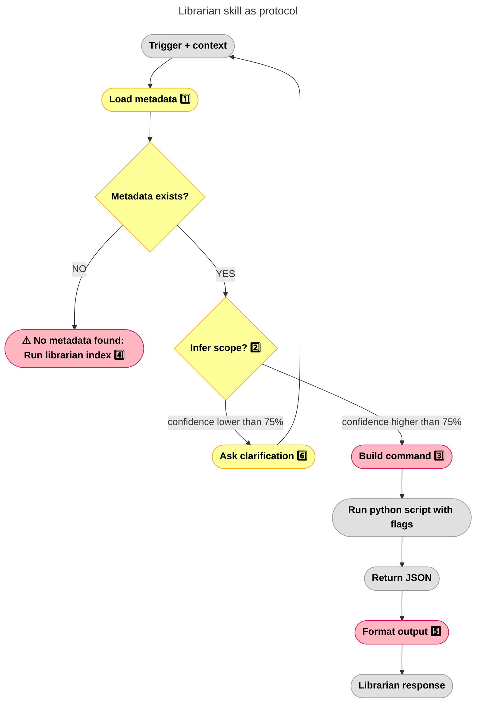

---

# Librarian Architecture

**Epic:** v0.15.0 — Skill Enforcement  
**Status:** 🟨 Design Phase  
**Date:** 2026-02-08

---

## Notes

### 1️⃣ Load Metadata (needs discussion)

**Current behavior:**
- Reads `.librarian-index.json` (global metadata)
- Reads multiple `.topic-index.json` files (per-topic embeddings)

**Question:** Should metadata loading be:
- **Explicit:** Skill tells research.py which files to load
- **Implicit:** research.py auto-discovers based on query
- **Hybrid:** Skill pre-filters, research.py refines

---

### 2️⃣ Scope Inference (needs discussion)

**Question:** Can system infer scope from context?

**Scope definition:**
- **Currently:** Topic OR Book
- **Future:** Author, tags, date range

**Confidence threshold:**
- **Currently:** Unknown (not implemented)
- **Recommendation:** Start at **75%** (balance between interruptions vs errors)
  - Above 75% → proceed with inference
  - Below 75% → ask clarification
- **Logic:** Better to ask once than return wrong results

**Examples:**
- "pesquisa servitors" + previous conversation about chaos magick → infer `--topics chaos-magick` (high confidence)
- "pesquisa economia" + no context → ask "qual tópico? finance? politics?" (low confidence)

**6️⃣ Ask Clarification - Defense Layer**

**Purpose:** AI, skill, and sh DEFEND librarian script against futile runs.

**Philosophy:** Subway map (metadata) → subway ride (query). Don't try to ride without the map.

**When triggered:**
- No explicit scope (`--book` or `--topics` missing)
- Low confidence on inference
- Prevents wasting compute on unclear queries

---

### 3️⃣ Build Command

**Question:** How to execute research.py?

**Syntax (from SKILL.md + research.py --help):**
```bash
cd ~/Documents/librarian && \
python3 engine/scripts/research.py "QUERY" --topic TOPIC_ID
# OR
python3 engine/scripts/research.py "QUERY" --book "filename.pdf"
```

**Parameters:**
- `--topic TOPIC_ID` - Topic name with underscores (e.g. `chaos-magick`)
- `--book "filename.pdf"` - Exact book filename
- `--top-k N` - Number of results (default: 5)
- `--context-window N` - Surrounding chunks (default: 1)

**Decision:** Where intelligence lives = TBD after diagram complete.

---

### 4️⃣ No Metadata = Hard Stop

**VISION.md principle:** Honesty > helpful lies.

**Error shown to user:**
```
"⚠️ No metadata found: Run librarian index"
```

**What happens:**
- **HARD STOP:** System does NOT attempt to answer without metadata
- Librarian = separate servitor (bounded, limited, task-oriented)
- If librarian can't fetch (no metadata) → be honest, don't invent

**Why:**
- "Não achei" = honest
- "Não achei mas vou responder de outros pontos" = dishonest (user asked librarian)
- Better to say "I don't have access" than give generic answer when user asked for books

---

### 5️⃣ Format Output

**Question:** What does format output do TODAY?

**From SKILL.md + research.prompt.md:**

**Input:** JSON from research.py
```json
{
  "results": [{
    "title": "Book Title",
    "source_file": "path/to/file.epub",
    "text": "...matched text...",
    "score": 0.XX
  }]
}
```

**Output:** Markdown with:
- **Citations:** Book title + matched text
- **Format:** Currently generic links (not Kavita deep-links)
- **No snippets expansion** (that's future - v1.4.0 Source Precision)

**Example:**
```markdown
**Found in "Book Title":**
> ...matched text...

**Source:** path/to/file.epub (score: 0.XX)
```

**Future enhancements (v1.4.0):**
- Kavita deep-links (paragraph/page precision)
- Context snippets (±N chunks around match)

---

### 7️⃣ Blueprint Sanity Check (Familiar → Blueprint)

**Rule:** Familiar must ALWAYS review blueprint and ask:
1. **"Does this make sense?"** - Logic coherent?
2. **"Do I have the tools to execute unsupervised?"** - Can I run this alone?

**If ambiguous → ASK, ASK, ASK.**

**Why:**
- Diagrams = agreements (contracts of execution)
- Ambiguity in blueprint = wasted effort
- Better to clarify NOW than debug LATER

**Examples:**
- ❌ "confidence lower than 75%" unclear → What's the threshold calculation?
- ✅ "75% = count(explicit_keywords) / count(total_words)" → Clear metric

**Librarian = servitor (bounded, limited).** I'm the familiar coordinating librarian servitor.

---

## 🎯 Objective

**Document what we want from librarian based on what we have.**

Adapt:
- **Prompt** (SKILL.md)
- **Shell wrapper** (.sh)
- **Python script** (.py)

---

## ✅ Success Metric

**Skill = Deterministic protocol**

- Trigger → follows ENTIRE protocol
- AI helps with:
  - Interpretation (from books)
  - Output (formatting, citations)
- Deterministic (same query = same behavior)

---

## Current State (Before)

**SKILL.md is overloaded:**
- Protocol logic mixed with usage instructions
- Hard to separate "how Claw uses it" from "how it works internally"
- Maintenance burden (update both places when things change)

---

## Goal (After)

Move intelligence to project, keep skill minimal.

---

## 🎨 Arch: Diagram Color System

**Visual language for diagram evolution:**

### Color Meanings

**Grey (`#E0E0E0`):** Building diagram
- Node exists but not yet discussed
- Structure only, no decisions made

**Pink (`#FFB6C1`, black text):** Needs discussion
- All nodes with emoji numbers (1️⃣, 2️⃣, 3️⃣)
- Questions to answer before proceeding
- Marks decision points

**Yellow (`#FFEB3B`, black text):** Approved
- Discussed and decided
- Ready for implementation
- Cleared for execution

**Blue (`#2196F3`, white text):** Executed
- Code matches diagram
- Map = territory
- Documentation of reality

### State Transitions

```
Grey → Pink: Add notes/questions (needs discussion)
Grey → Yellow: No questions, approved as-is
Pink → Yellow: Questions answered, approved
Yellow → Blue: Code implemented

All Yellow = Ready to execute (I can run without Nicholas)
All Blue = Complete (diagram = documentation)
```

### Philosophy

**Important:** Ask ALL questions (technical + architecture) so Nicholas can get out of the way and I run safely without input.

**Goal:** Maximum parity between map (diagram) and territory (code).

---

**Status:** Grey flow started. Pink nodes = open questions.
