```mermaid
---
title: Librarian skill as protocol
---
flowchart TD
    TRIGGER["Trigger + context"]
    TRIGGER --> METADATA["Load metadata 1️⃣"]
    METADATA --> CHECK{"Metadata exists?"}
    CHECK -->|NO| ERROR["⚠️ No indexed topics found"]
    ERROR --> EXIT["Exit (fail early)"]
    CHECK -->|YES| INFER{"Infer scope? 2️⃣"}
    
    INFER -->|"< 75%"| CLARIFY["Ask clarification"]
    CLARIFY --> TRIGGER
    
    INFER -->|"> 75%"| BUILD["Build command 3️⃣"]
    
    BUILD --> EXEC["Run research.py"]
    EXEC --> JSON["Return JSON"]
    JSON --> FORMAT["Format output"]
    FORMAT --> USER["Response"]
    
    style TRIGGER fill:#E0E0E0,stroke:#9E9E9E,color:#000
    style METADATA fill:#FFB6C1,stroke:#D81B60,color:#000
    style INFER fill:#FFB6C1,stroke:#D81B60,color:#000
    style CLARIFY fill:#E0E0E0,stroke:#9E9E9E,color:#000
    style BUILD fill:#FFB6C1,stroke:#D81B60,color:#000
    style EXEC fill:#E0E0E0,stroke:#9E9E9E,color:#000
    style JSON fill:#E0E0E0,stroke:#9E9E9E,color:#000
    style FORMAT fill:#E0E0E0,stroke:#9E9E9E,color:#000
    style USER fill:#E0E0E0,stroke:#9E9E9E,color:#000
    style CHECK fill:#FFB6C1,stroke:#D81B60,color:#000
    style ERROR fill:#FF9800,stroke:#F57C00,color:#000
    style EXIT fill:#E0E0E0,stroke:#9E9E9E,color:#000
```

---

# Librarian Architecture

**Epic:** v0.15.0 — Skill Enforcement  
**Status:** 🟨 Design Phase  
**Date:** 2026-02-08

---

## Notes

### 1️⃣ Load Metadata (needs discussion)

**Current behavior:**
- Reads `.librarian-index.json` (global metadata)
- Reads multiple `.topic-index.json` files (per-topic embeddings)

**Question:** Should metadata loading be:
- **Explicit:** Skill tells research.py which files to load
- **Implicit:** research.py auto-discovers based on query
- **Hybrid:** Skill pre-filters, research.py refines

---

### 2️⃣ Scope Inference (needs discussion)

**Question:** Can system infer scope from context?

**Scope definition:**
- **Currently:** Topic OR Book
- **Future:** Author, tags, date range

**Confidence threshold:**
- **Currently:** Unknown (not implemented)
- **Recommendation:** Start at **75%** (balance between interruptions vs errors)
  - Above 75% → proceed with inference
  - Below 75% → ask clarification
- **Logic:** Better to ask once than return wrong results

**Examples:**
- "pesquisa servitors" + previous conversation about chaos magick → infer `--topics chaos-magick` (high confidence)
- "pesquisa economia" + no context → ask "qual tópico? finance? politics?" (low confidence)

---

### 3️⃣ Build Command (needs discussion)

**Current:**
```bash
cd ~/Documents/librarian && \
python3 engine/scripts/research.py "QUERY" --topics topic1,topic2
```

**Questions:**
- Should command building happen in **SKILL.md** (AI constructs it) or **shell wrapper** (deterministic)?
- Should we rename `research.py` → `librarian.py`?
  - **Pro:** Matches system name
  - **Con:** "research" is the action users understand
  - **Alternative:** Keep `research.py` as entry point, `librarian.py` as orchestrator

**Decision needed:** Where does intelligence live? (AI vs shell script)

---

## 🎯 Objective

**Document what we want from librarian based on what we have.**

Adapt:
- **Prompt** (SKILL.md)
- **Shell wrapper** (.sh)
- **Python script** (.py)

---

## ✅ Success Metric

**Skill = Deterministic protocol**

- Trigger → follows ENTIRE protocol
- AI helps with:
  - Interpretation (from books)
  - Output (formatting, citations)
- Deterministic (same query = same behavior)

---

## Current State (Before)

**SKILL.md is overloaded:**
- Protocol logic mixed with usage instructions
- Hard to separate "how Claw uses it" from "how it works internally"
- Maintenance burden (update both places when things change)

---

## Goal (After)

Move intelligence to project, keep skill minimal.

---

## 🎨 Arch: Diagram Color System

**Visual language for diagram evolution:**

### Color Meanings

**Grey (`#E0E0E0`):** Building diagram
- Node exists but not yet discussed
- Structure only, no decisions made

**Pink (`#FFB6C1`, black text):** Needs discussion
- All nodes with emoji numbers (1️⃣, 2️⃣, 3️⃣)
- Questions to answer before proceeding
- Marks decision points

**Yellow (`#FFEB3B`, black text):** Approved
- Discussed and decided
- Ready for implementation
- Cleared for execution

**Blue (`#2196F3`, white text):** Executed
- Code matches diagram
- Map = territory
- Documentation of reality

### State Transitions

```
Grey → Pink: Add notes/questions (needs discussion)
Grey → Yellow: No questions, approved as-is
Pink → Yellow: Questions answered, approved
Yellow → Blue: Code implemented

All Yellow = Ready to execute (I can run without Nicholas)
All Blue = Complete (diagram = documentation)
```

### Philosophy

**Important:** Ask ALL questions (technical + architecture) so Nicholas can get out of the way and I run safely without input.

**Goal:** Maximum parity between map (diagram) and territory (code).

---

**Status:** Grey flow started. Pink nodes = open questions.
