**v0.15.0 - Skill as Protocol**

```mermaid
flowchart TB
    TRIGGER(["Trigger + context"])
    TRIGGER --> METADATA(["Load metadata _1_"])
    METADATA --> CHECK{"Metadata exists?"}
    
    CHECK -->|"No"| ERROR(["*🤚 No metadata found:<br>Run librarian index* _5_"])
    CHECK -->|"Yes"| INFER{"Infer scope? _2_"}
    
    INFER -->|"confidence<br>lower than 75%"| CLARIFY(["*🤚 Say it again?* _5_"])
    INFER -->|"confidence<br>higher than 75%"| BUILD(["Build command _3_"])
    
    BUILD --> CHECK_SYSTEM{"System working?"}
    
    CHECK_SYSTEM -->|"No"| BROKEN(["*🤚 System is broken* _5_"])
    CHECK_SYSTEM -->|"Yes"| EXEC(["Run python script with flags"])
    
    EXEC --> JSON(["Return JSON"])
    JSON --> CHECK_RESULTS{"Results found?"}
    
    CHECK_RESULTS -->|"No"| EMPTY(["*🤚 No results found* _5_"])
    CHECK_RESULTS -->|"Yes"| FORMAT(["Format output _4_"])
    
    FORMAT --> RESPONSE(["Librarian response"])
    
    style TRIGGER fill:#FFFFCC,stroke:#F9A825,color:#000
    style METADATA fill:#FFFF99,stroke:#F9A825,color:#000
    style INFER fill:#FFFF99,stroke:#F9A825,color:#000
    style CLARIFY fill:#FFFF99,stroke:#F9A825,color:#000
    style BUILD fill:#FFFF99,stroke:#F9A825,color:#000
    style EXEC fill:#FFFFCC,stroke:#F9A825,color:#000
    style JSON fill:#FFFFCC,stroke:#F9A825,color:#000
    style FORMAT fill:#FFFF99,stroke:#F9A825,color:#000
    style RESPONSE fill:#FFFFCC,stroke:#F9A825,color:#000
    style CHECK fill:#FFFF99,stroke:#F9A825,color:#000
    style ERROR fill:#FFFF99,stroke:#F9A825,color:#000
    style CHECK_SYSTEM fill:#FFFF99,stroke:#F9A825,color:#000
    style BROKEN fill:#FFFF99,stroke:#F9A825,color:#000
    style CHECK_RESULTS fill:#FFFF99,stroke:#F9A825,color:#000
    style EMPTY fill:#FFFF99,stroke:#F9A825,color:#000
```



---

1. **Load Metadata (needs discussion)**

**Current behavior:**
- Reads `.librarian-index.json` (global metadata)
- Reads multiple `.topic-index.json` files (per-topic embeddings)

**Question:** Should metadata loading be:
- **Explicit:** Skill tells research.py which files to load
- **Implicit:** research.py auto-discovers based on query
- **Hybrid:** Skill pre-filters, research.py refines

---

2. **Scope Inference (needs discussion)**

**Question:** Can system infer scope from context?

**Scope definition:**
- **Currently:** Topic OR Book
- **Future:** Author, tags, date range

**Confidence threshold:**
- **Currently:** Unknown (not implemented)
- **Recommendation:** Start at **75%** (balance between interruptions vs errors)
  - Above 75% → proceed with inference
  - Below 75% → ask clarification
- **Logic:** Better to ask once than return wrong results

**Examples:**
- "pesquisa servitors" + previous conversation about chaos magick → infer `--topics chaos-magick` (high confidence)
- "pesquisa economia" + no context → ask "qual tópico? finance? politics?" (low confidence)

---

5. **🤚 HARD STOP Function**

**Purpose:** Protect librarian from futile execution. Honesty > helpfulness.

**What it means:**
- **AI stops immediately** - No attempt to answer from general knowledge
- **User sees exact message** (italics = verbatim user copy)
- **System state preserved** - No partial execution, no side effects

**When triggered:**
- *"🤚 No metadata found: Run librarian index"* - Metadata missing
- *"🤚 Say it again?"* - Scope unclear (low confidence)
- *"🤚 System is broken"* - Python/library/research.py failure
- *"🤚 No results found"* - Query returned empty (metadata ✅, scope ✅, system ✅, but nothing matches)

**Why centralized:**
- Refine ONCE, all nodes benefit
- Consistent user experience
- Clear protocol boundary (librarian servitor is bounded)

**VISION.md principle:** "Não achei" (honest) > invention (dishonest when user asked librarian specifically)

**Future:** See [v1.6.0 - Granular Error Handling](https://github.com/nonlinear/librarian/blob/main/backstage/ROADMAP.md#v160) for detailed error types (Python missing, timeout, disk full, etc.)

---

3. **Build Command**

**Question:** How to execute research.py?

**Syntax (from SKILL.md + research.py --help):**
```bash
cd ~/Documents/librarian && \
python3 engine/scripts/research.py "QUERY" --topic TOPIC_ID
# OR
python3 engine/scripts/research.py "QUERY" --book "filename.pdf"
```

**Parameters:**
- `--topic TOPIC_ID` - Topic name with underscores (e.g. `chaos-magick`)
- `--book "filename.pdf"` - Exact book filename
- `--top-k N` - Number of results (default: 5)
- `--context-window N` - Surrounding chunks (default: 1)

**Decision:** Where intelligence lives = TBD after diagram complete.

---

4. **Format Output**

**Current format (from research.prompt.md):**

```
According to DeLanda 1️⃣, gradients drive morphogenesis. This connects to Deleuze's concept 2️⃣.

---

**Topic:** anthropocene/theory

---

1️⃣ [Molecular Red.epub](../personal%20library/books/anthropocene/Molecular%20Red.epub)

    gradients drive morphogenesis matter

2️⃣ [A Thousand Plateaus.epub](../personal%20library/books/anthropocene/A%20Thousand%20Plateaus.epub)

    intensive differences create forms
```

**Structure:**
- Synthesized answer with emoji citations (1️⃣ 2️⃣ 3️⃣)
- `---` separator
- `**Topic:** {folder_path}` (not topic ID)
- `---` separator
- Citation list: emoji + `[filename](relative_path)` + indented 4-word snippet

**Future (v1.4.0 Source Precision):**
- Kavita deep-links (paragraph/page precision)
- Context snippets (±N chunks around match)

---

## 📋 Tasks

### CLARIFY loop - Follow-up as further trigger

**Question:** When user clarifies scope after "Can you be clearer?", does system:
- A) Append to original trigger (smarter, less repetition)
- B) Treat as new trigger + context (simpler, current approach)

**Current decision:** B (new trigger + context). Test A in future.

**Why test:** If system can intelligently append context, reduces user friction.

**Epic:** Future enhancement (not blocking v0.15.0)

---

## 🎯 Objective

**Document what we want from librarian based on what we have.**

Adapt:
- **Prompt** (SKILL.md)
- **Shell wrapper** (.sh)
- **Python script** (.py)

---

## ✅ Success Metric

**Skill = Deterministic protocol**

- Trigger → follows ENTIRE protocol
- AI helps with:
  - Interpretation (from books)
  - Output (formatting, citations)
- Deterministic (same query = same behavior)

---

## Current State (Before)

**SKILL.md is overloaded:**
- Protocol logic mixed with usage instructions
- Hard to separate "how Claw uses it" from "how it works internally"
- Maintenance burden (update both places when things change)

---

## Goal (After)

Move intelligence to project, keep skill minimal.

---

## 🎨 Arch: Diagram Color System

**Visual language for diagram evolution:**

### Color Meanings

**Grey (`#E0E0E0`):** Building diagram
- Node exists but not yet discussed
- Structure only, no decisions made

**Pink (`#FFB6C1`, black text):** Needs discussion
- All nodes with emoji numbers (1️⃣, 2️⃣, 3️⃣)
- Questions to answer before proceeding
- Marks decision points

**Yellow (`#FFEB3B`, black text):** Approved
- Discussed and decided
- Ready for implementation
- Cleared for execution

**Blue (`#2196F3`, white text):** Executed
- Code matches diagram
- Map = territory
- Documentation of reality

### State Transitions

```
Grey → Pink: Add notes/questions (needs discussion)
Grey → Yellow: No questions, approved as-is
Pink → Yellow: Questions answered, approved
Yellow → Blue: Code implemented

All Yellow = Ready to execute (I can run without Nicholas)
All Blue = Complete (diagram = documentation)
```

### Philosophy

**Important:** Ask ALL questions (technical + architecture) so Nicholas can get out of the way and I run safely without input.

**Goal:** Maximum parity between map (diagram) and territory (code).

---

**Status:** Grey flow started. Pink nodes = open questions.

---

## 🔄 Meta: Main Project + Side Project Pattern

**Observation:** We're using librarian (main project) to refine arch skill (side project).

**Pattern:**
- **Main:** Active work (librarian epic v0.15.0)
- **Side:** Meta-learning (arch skill protocol)
- **Method:** Extract learnings from main → document in side

**Future need:** System to track:
- Which project is "main" (active epic)
- Which project is "side" (meta-learning from main's structure)
- Cross-pollination (learnings flow both ways)

**Example today:**
- Main: `~/Documents/librarian/` (epic v0.15.0 - skill protocol)
- Side: `~/.openclaw/skills/arch/` (future skill, learning from this session)
- Artifact: `arch-session-2026-02-08.md` (extracted learnings)

**Why important:**
- Prevents meta-work from hijacking main work
- Documents cross-project learnings
- Future skill can reference "how we built it"

**Task created:** Add to librarian ROADMAP or global backstage POLICY

---

## 🎯 Why This Works (Nicholas's Pride)

**Sandbox = safe experimentation:**
- Epics isolated (branch)
- Diagrams versioned (epic-notes/)
- Nodes explicit (mermaid)

**Planning vs Execution separation:**
- **Planning (arch:):** I can opine freely, suggest, debate
- **Execution (post-diagram):** I execute without errors, everything agreed

**First epic = hard (create from scratch):**
- v0.15.0 = 29 commits, 4 hours, diagram completo

**Second epic = easy (alter existing):**
- v0.16.0 = "arch: add reranking node" → 1 commit
- Diagram = living document, cada epic refina

**Key insight:**
- **Todos epics mudam estrutura** → todos precisam arch
- **Epic notes tem diagrama** → eu SEI estado atual
- **"arch: muda X"** → eu SEI exatamente O QUE mudar, O QUE manter
- **Diff visual** → screenshots mostram APENAS delta

**Low metabolic cost:** Alterar > recriar

**Nicholas:** "Acho OTIMO e to muito orgulhoso disso." ✨

---
