**v0.15.0 - Skill as Protocol**

```mermaid
flowchart TB
    TRIGGER(["🎤 Trigger + context<br/>✅ Works"])
    TRIGGER --> METADATA(["👷 Load metadata _1_<br/>⚫ Not implemented"])
    METADATA --> CHECK{"👷 Metadata exists?<br/>⚫ Not implemented"}
    
    CHECK -->|"No"| ERROR(["🎤 *🤚 No metadata found:<br>Run librarian index* _5_"])
    CHECK -->|"Yes"| INFER{"🎤 Infer scope? _2_<br/>🔴 Broken"}
    
    INFER -->|"confidence<br>lower than 75%"| CLARIFY(["🎤 *🤚 Say it again?* _5_"])
    INFER -->|"confidence<br>higher than 75%"| BUILD(["👷 Build command _3_<br/>✅ Created"])
    
    BUILD --> CHECK_SYSTEM{"⚙️ System working?<br/>✅ Works"}
    
    CHECK_SYSTEM -->|"No"| BROKEN(["🎤 *🤚 System is broken* _5_"])
    CHECK_SYSTEM -->|"Yes"| EXEC(["⚙️ Run python script with flags<br/>✅ Implemented"])
    
    EXEC --> JSON(["⚙️ Return JSON<br/>✅ Works"])
    JSON --> CHECK_RESULTS{"👷 Results found?<br/>✅ Implemented"}
    
    CHECK_RESULTS -->|"No"| EMPTY(["🎤 *🤚 No results found* _5_<br/>✅ Implemented"])
    CHECK_RESULTS -->|"Yes"| FORMAT(["🎤 Format output _4_<br/>✅ Implemented"])
    
    FORMAT --> RESPONSE(["🎤 Librarian response<br/>✅ Works"])
    
    style TRIGGER fill:#FFE083,stroke:#FFB74D,color:#000
    style METADATA fill:#CECECE,stroke:#9E9E9E,color:#fff
    style INFER fill:#FAB3AE,stroke:#E57373,color:#fff
    style CLARIFY fill:#FFE083,stroke:#FFB74D,color:#000
    style BUILD fill:#90CAF9,stroke:#64B5F6,color:#fff
    style EXEC fill:#90CAF9,stroke:#64B5F6,color:#fff
    style JSON fill:#90CAF9,stroke:#64B5F6,color:#fff
    style FORMAT fill:#90CAF9,stroke:#64B5F6,color:#fff
    style RESPONSE fill:#90CAF9,stroke:#64B5F6,color:#fff
    style CHECK fill:#CECECE,stroke:#9E9E9E,color:#fff
    style ERROR fill:#FFE083,stroke:#FFB74D,color:#000
    style CHECK_SYSTEM fill:#90CAF9,stroke:#64B5F6,color:#fff
    style BROKEN fill:#FFE083,stroke:#FFB74D,color:#000
    style CHECK_RESULTS fill:#90CAF9,stroke:#64B5F6,color:#fff
    style EMPTY fill:#90CAF9,stroke:#64B5F6,color:#fff
```




---

**Legend:**

<table>
  <tr>
    <th></th>
    <th>Name</th>
    <th>Use this color when...</th>
  </tr>
  <tr>
    <td style="background-color: #CECECE; color: black; text-align: center; width: 60px; font-weight: bold; font-size: 18px;">1</td>
    <td>Neutral</td>
    <td>No agreement yet. Backlog, not discussed, not approved.</td>
  </tr>
  <tr>
    <td style="background-color: #FFE083; color: black; text-align: center; width: 60px; font-weight: bold; font-size: 18px;">2</td>
    <td>Agreed / Ready</td>
    <td>Agreed by all stakeholders, ready for development. Sometimes has notes.</td>
  </tr>
  <tr>
    <td style="background-color: #FAB3AE; color: black; text-align: center; width: 60px; font-weight: bold; font-size: 18px;">3</td>
    <td>Blocked / Failed</td>
    <td>Either needs discussion to agree, OR failed implementation. <strong>Always with numbered note.</strong> Blocker.</td>
  </tr>
  <tr>
    <td style="background-color: #90CAF9; color: black; text-align: center; width: 60px; font-weight: bold; font-size: 18px;">4</td>
    <td>Implemented / Working</td>
    <td>Implemented, tested, and functional. Done.</td>
  </tr>
</table>

**Advanced states (use when applicable):**

<table>
  <tr>
    <th></th>
    <th>Name</th>
    <th>Use this color when...</th>
  </tr>
  <tr>
    <td style="background-color: #FFCB7F; color: black; text-align: center; width: 60px; font-weight: bold; font-size: 18px;">5</td>
    <td>Needs Validation</td>
    <td>Code/component exists but not tested or approved yet.</td>
  </tr>
  <tr>
    <td style="background-color: #D7A8DF; color: black; text-align: center; width: 60px; font-weight: bold; font-size: 18px;">6</td>
    <td>Partially Working</td>
    <td>Some paths work, others don't. <strong>Use numbered note for details.</strong></td>
  </tr>
</table>

**Symbols:**
- 🎤 Skill (SKILL.md, AI prompts) - Conversational layer
- 👷 Shell (wrapper script) - Protocol enforcement
- ⚙️ Python (research.py) - Heavy lifting

---

**Status:** 🚨 URGENT  
**Created:** 2026-02-08  
**Priority:** CRITICAL (blocks trust in all skills)

---

## Problem


---

## Problem


**Skills não são confiáveis se o protocolo vive apenas em SKILL.md.**

**Example failure (today):**
- User: "pesquisa SPLIFF method"
- Librarian SKILL.md says: "If no results → say 'não achei', NEVER invent"
- I violated protocol: invented explanation from "general knowledge"
- **Result:** Mentira. Trust broken.

**Root cause:**
- SKILL.md = text prompt (ambiguous, can be ignored by LLM)
- No enforcement mechanism
- Checklist without punishment = teatro

**Analogia:**
- If Jira API breaks and I INVENT tasks → you make decisions based on lies
- If Librarian returns empty and I INVENT facts → same problem
- **Silence > mentira**

---

## Sandwich Architecture

**Flow:** 🎤 Skill → 👷 Sh → ⚙️ Py → 👷 Sh → 🎤 Skill

**Why this pattern:**
1. **🎤 Skill** interprets user intent (conversational, flexible, handles ambiguity)
2. **👷 Sh** builds correct command syntax (skill errs often, sh hardens protocol)
3. **⚙️ Py** executes deterministic work (search, embeddings, JSON output)
4. **👷 Sh** formats py output to structured syntax (protocol compliance)
5. **🎤 Skill** presents to human (natural language, citations, formatting)

**Benefit:** If this works, apply to OTHER skills for hardening. Sandwich = separation of concerns.

**Node Domain Mapping:**
- **TRIGGER** = 🎤 (conversational entry point)
- **METADATA** = 👷 (load files, deterministic)
- **CHECK** = 👷 (file exists check)
- **INFER** = 🎤 (confidence >75%, conversational inference)
- **CLARIFY** = 🎤 (ask user for clarification)
- **BUILD** = 👷 (construct command syntax)
- **CHECK_SYSTEM** = ⚙️ (validate engine health)
- **EXEC** = ⚙️ (run research.py)
- **JSON** = ⚙️ (return search results)
- **CHECK_RESULTS** = 👷 (validate JSON structure)
- **FORMAT** = 🎤 (natural language output)
- **ERROR/BROKEN/EMPTY** = 🎤 (user messaging, honest failure)
- **RESPONSE** = 🎤 (final output to human)

---

## Domain Decision Tree

**How to assign domain to each node:**

```mermaid
flowchart TB
    START(["Node logic"])
    START --> Q1{"Determinístico?<br>(Same input = same output)"}
    
    Q1 -->|"Não<br>(conversational,<br>context-dependent)"| SKILL["Domain: skill<br>(SKILL.md)"]
    Q1 -->|"Sim"| Q2{"Heavy lifting?<br>(embeddings, search,<br>computation)"}
    
    Q2 -->|"Sim"| PY["Domain: py<br>(research.py)"]
    Q2 -->|"Não"| Q3{"Orchestração?<br>(PRIMEIRO isso,<br>DEPOIS isso)"}
    
    Q3 -->|"Sim"| SH["Domain: sh<br>(wrapper script)"]
    Q3 -->|"Não"| UNCLEAR["Default: sh<br>(butler/facilitator)"]
    
    style SKILL fill:#E8F5E9,stroke:#4CAF50
    style PY fill:#E3F2FD,stroke:#2196F3
    style SH fill:#FFF3E0,stroke:#FF9800
    style UNCLEAR fill:#FFF3E0,stroke:#FF9800
```



**Domain definitions:**

- **🎤 skill (SKILL.md):** Prompt only, non-deterministic, AI interprets + formats
- **⚙️ py (research.py):** Heavy lifting (embeddings, search, JSON), deterministic
- **👷 sh (wrapper script):** Protocol enforcement, orchestration (PRIMEIRO → DEPOIS). **Sh = butler** - facilitates, enforces order, validates steps. **When logic is ambiguous, default to sh** (protocols have specific order).

---

## Protocol Nodes

**1. Load Metadata:** Reads `.librarian-index.json` + `.topic-index.json` files

**2. Infer Scope:** Confidence >75% → proceed | <75% → ask clarification

**3. Build Command:** `python3 research.py "QUERY" --topic TOPIC_ID`

**4. Format Output:** Synthesized answer + emoji citations + sources

**5. 🤚 Hard Stop:** Honest failure > invented answer (VISION.md principle)

---

## Open Questions

**Resolved:**
- ✅ `--book` flag: Book and topic are both SCOPES (added to notes)
- ✅ Domain mapping: Complete (see Sandwich Architecture above)

**Deferred to execution phase:**
- Sh script specs (metadata paths, command templates, result validation)
- Py engine specs (system check method, exact invocation, JSON format)
- Skill prompts (confidence calculation, citation format, error messages)

**Next:** Execution validation (autonomous implementation while Nicholas sleeps)

---

## Execution Spec (What I Need to Implement)

**Status:** 🔴 **INCOMPLETE** - Missing critical specs below

### 🎤 Skill Nodes (SKILL.md / AI prompts)

**TRIGGER:**
- ✅ Entry point clear
- ❌ **Missing:** What triggers? User message pattern? Specific phrases?
- ❌ **Missing:** Context = what exactly? Recent messages? User profile?

**INFER (Confidence >75%):**
- ❌ **Missing:** HOW to calculate confidence? Keyword matching? LLM confidence score?
- ❌ **Missing:** What signals = high confidence? (exact topic name? clear query?)
- ❌ **Missing:** What signals = low confidence? (ambiguous? multiple topics?)
- ❌ **Missing:** Pattern examples (high vs low confidence)

**CLARIFY:**
- ❌ **Missing:** Exact message template? "I need more context about X"?
- ❌ **Missing:** What questions to ask? Topic? Book? Both?
- ❌ **Missing:** How many retries before hard stop?

**FORMAT:**
- ❌ **Missing:** Citation format? Emoji placement rules?
- ❌ **Missing:** Source list format? Book titles? Page numbers?
- ❌ **Missing:** Synthesis vs direct quotes?
- ❌ **Missing:** Length limits? Truncation rules?

**ERROR/BROKEN/EMPTY (🤚 messages):**
- ❌ **Missing:** Exact wording for each error type
- ❌ **Missing:** Tone (conversational? technical? empathetic?)
- ❌ **Missing:** Actionable next steps for user?

**RESPONSE:**
- ✅ Final output to human (uses FORMAT spec above)

---

### 👷 Sh Nodes (Wrapper script / Orchestration)

**METADATA (Load files):**
- ❌ **Missing:** File paths? `~/Documents/librarian/.librarian-index.json`?
- ❌ **Missing:** Fallback if file missing? Create? Error?
- ❌ **Missing:** Parse JSON? Validate structure?
- ❌ **Missing:** What data extract? Topic IDs? Book IDs? Both?

**CHECK (Metadata exists?):**
- ❌ **Missing:** Check what exactly? File exists? File not empty? Valid JSON?
- ❌ **Missing:** Multiple files? Check both .librarian-index + .topic-index?

**BUILD (Command construction):**
- ❌ **Missing:** Exact template? `python3 ~/Documents/librarian/research.py "QUERY" --topic TOPIC_ID`?
- ❌ **Missing:** Working directory? `~/Documents/librarian/`?
- ❌ **Missing:** Escaping rules? Quote handling for query?
- ❌ **Missing:** Flag validation? Topic exists in metadata?
- ❌ **Missing:** `--book` support? (Book + topic are scopes, but how to pass?)

**CHECK_RESULTS (Validate JSON):**
- ❌ **Missing:** JSON structure expected? `{"results": [...]}` or `[...]`?
- ❌ **Missing:** Empty = `null`? `[]`? `{"results": []}`?
- ❌ **Missing:** Required fields? (title, snippet, source?)
- ❌ **Missing:** Validation logic? Count > 0? Results not null?

---

### ⚙️ Py Nodes (Engine / research.py)

**CHECK_SYSTEM (Validate engine health):**
- ❌ **Missing:** HOW to check? Import test? `python3 -c "import research"`?
- ❌ **Missing:** File exists? `~/Documents/librarian/research.py`?
- ❌ **Missing:** Dependencies check? Vector DB accessible?
- ❌ **Missing:** Index health? Embeddings loaded?

**EXEC (Run research.py):**
- ❌ **Missing:** Exact invocation from sh script
- ❌ **Missing:** Environment variables needed?
- ❌ **Missing:** Timeout? Kill if hangs?
- ❌ **Missing:** stderr handling? Log errors where?

**JSON (Return results):**
- ❌ **Missing:** Output format from research.py (confirm structure)
- ❌ **Missing:** Where output goes? stdout? file? pipe?
- ❌ **Missing:** Error JSON format? Exit codes?

---

### Cross-Cutting Concerns

**File Paths:**
- ❌ **Missing:** Absolute paths? Relative to what?
- ❌ **Missing:** librarian project location documented? `~/Documents/librarian/`?

**Error Propagation:**
- ❌ **Missing:** How errors flow between domains? (py → sh → skill)
- ❌ **Missing:** Exit codes? Status signals?

**Testing Strategy:**
- ❌ **Missing:** How to test sh script without breaking py?
- ❌ **Missing:** Mock data? Fixtures?
- ❌ **Missing:** Success criteria per node?

**Color Coding Rules:**
- ✅ 🔵 Blue = works
- ✅ 🟠 Orange = works but decisions need discussion
- ✅ 🔴 Red = blocked
- ❌ **Missing:** WHEN to use each? Criteria?

---

### What I Can Do Tonight (vs Need Specs)

**Can implement without specs:**
- ❌ None - every node needs specs above

**Can document as blockers:**
- ✅ All missing specs above
- ✅ Proposal for each (you validate tomorrow)

**Can research autonomously:**
- ✅ Check existing librarian code (research.py, index files)
- ✅ Infer specs from current implementation
- ✅ Document assumptions (mark as 🟠 orange = verify)

---

### Recommendation

**Tonight I should:**
1. ✅ Read existing librarian code (research.py, SKILL.md, scripts)
2. ✅ Document CURRENT implementation (reverse-engineer specs)
3. ✅ Note discrepancies (diagram vs reality)
4. 🟠 Propose specs for missing nodes (you validate tomorrow)
5. 🔴 Block on anything I can't infer from code

**Tomorrow you:**
1. Review my findings (current implementation)
2. Validate proposed specs (or correct)
3. Approve execution (or refine diagram)

**Sound good?** Or want me to attempt execution with assumptions (risky)?

---

## Research Findings (2026-02-11)

**Query:** "skill protocol AI design patterns"

**Source:** Agentic Design Patterns (ai_prompt_engineering topic)

**Key matches:**
- Prompt Chaining: 96.1% - Sequential task decomposition
- A2A Protocol: 94.4% - Inter-agent communication
- Tool Use: 98.1% - External system integration
- Memory Management: 93.8% - State persistence

**Conclusion:** Skill protocol = industry-standard agentic patterns (not invented, implemented).

---

## Success Metric

Skill = deterministic protocol. Same query → same behavior. AI interprets + formats, protocol executes.

---

## Implementation (2026-02-12)

**Created:** `librarian.py` + `librarian.sh` (wrappers following protocol)

**Location:** `~/.openclaw/skills/librarian/`

### Shell Wrapper (`librarian.sh`)

```bash
#!/bin/bash
# Librarian Skill - Shell Wrapper
# Enforces ZERO TOLERANCE protocol for book research
#
# Usage:
#   librarian.sh "query" --topics topic1,topic2 [--top-k N]

set -euo pipefail

SKILL_DIR="$( cd "$( dirname "${BASH_SOURCE[0]}" )" && pwd )"
LIBRARIAN_PY="${SKILL_DIR}/librarian.py"

# Check if librarian.py exists
if [[ ! -f "$LIBRARIAN_PY" ]]; then
    echo "❌ ERROR: librarian.py not found at: $LIBRARIAN_PY"
    exit 1
fi

# Check if query provided
if [[ $# -lt 1 ]]; then
    echo "❌ ERROR: Query required"
    echo ""
    echo "Usage: librarian.sh \"query\" --topics topic1,topic2"
    exit 1
fi

# Run Python wrapper (passes all args through)
python3 "$LIBRARIAN_PY" "$@"
```

### Python Wrapper (`librarian.py`)

```python
#!/usr/bin/env python3
"""
Librarian Skill - Python Wrapper
Enforces ZERO TOLERANCE protocol for book research.
"""

import sys
import json
import subprocess
from pathlib import Path

LIBRARIAN_PATH = Path.home() / "Documents" / "librarian"
RESEARCH_SCRIPT = LIBRARIAN_PATH / "engine" / "scripts" / "research.py"


def main():
    if len(sys.argv) < 2:
        print("❌ ERROR: Query required")
        print("Usage: librarian.py \"query\" --topics topic1,topic2")
        sys.exit(1)

    # Build command
    cmd = ["python3", str(RESEARCH_SCRIPT)] + sys.argv[1:]

    # Run research.py
    try:
        result = subprocess.run(
            cmd,
            cwd=str(LIBRARIAN_PATH),
            capture_output=True,
            text=True,
            timeout=60
        )
    except subprocess.TimeoutExpired:
        print("❌ ERROR: Research timed out (>60s)")
        sys.exit(1)
    except Exception as e:
        print(f"❌ ERROR: Failed to run research.py: {e}")
        sys.exit(1)

    # Check for errors
    if result.returncode != 0:
        print(f"❌ ERROR: research.py failed (exit {result.returncode})")
        if result.stderr:
            print(result.stderr)
        sys.exit(1)

    # Parse JSON output
    try:
        data = json.loads(result.stdout)
    except json.JSONDecodeError as e:
        print("❌ ERROR: Invalid JSON output from research.py")
        print(f"Raw output: {result.stdout[:500]}")
        sys.exit(1)

    # Check if empty results
    results = data.get("results", [])
    if not results:
        query = sys.argv[1]
        topics = next((arg.split("--topics=")[-1] for arg in sys.argv if "--topics" in arg), "unknown")
        print(f"❌ Não achei resultados sobre \"{query}\" nos topics: {topics}")
        print("\n💡 Sugestões:")
        print("- Verifique se o topic está indexado (run index_library.py)")
        print("- Tente outros topics ou query mais ampla")
        sys.exit(1)

    # Format results as citations
    query = sys.argv[1]
    topics = next((arg.split("--topics=")[-1] for arg in sys.argv if "--topics" in arg), "unknown")
    
    print(f"📚 **RESEARCH:** {query}")
    print(f"\nAchei **{len(results)} resultado(s)** nos topics: {topics}\n")
    print("---\n")

    for idx, result in enumerate(results, 1):
        title = result.get("title", "Untitled")
        source = result.get("source_file", "Unknown source")
        text = result.get("text", "")
        score = result.get("score", 0.0)

        # Extract book name from path
        book_name = Path(source).stem.replace("-", " ").title()

        print(f"{idx}️⃣ **{title}**")
        print(f"**Fonte:** *{book_name}* (score: {score:.2f})")
        print(f"\n> {text}\n")
        print("---\n")

    # List unique sources
    sources = list(set(Path(r.get("source_file", "")).stem for r in results))
    if sources:
        print("**Fontes citadas:**")
        for source in sources:
            book_name = source.replace("-", " ").title()
            print(f"- *{book_name}*")


if __name__ == "__main__":
    main()
```

### How It Works

**Flow:**
1. User says "pesquisa X" → I detect trigger
2. I run: `~/.openclaw/skills/librarian/librarian.sh "X" --topics Y`
3. Shell wrapper calls Python wrapper
4. Python wrapper:
   - Runs `research.py` with exact syntax
   - Checks JSON output (empty → "não achei")
   - Formats results (numbered citations with sources)
   - Returns formatted text
5. I show output AS-IS (no interpretation)

**Enforcement:**
- ✅ **Exact syntax** - Python subprocess ensures no ambiguity
- ✅ **Empty check** - Script exits if no results (I can't invent)
- ✅ **Formatted output** - Numbered citations (1️⃣ 2️⃣ 3️⃣)
- ✅ **Timeout** - 60s max (prevents hang)
- ✅ **Error handling** - Clear messages for failures
- ✅ **Zero interpretation** - I only show what script returns

**Result:** **Impossible to invent facts.** Script runs or doesn't. Output is citations or error. No room for LLM deviation.

---

## Component Status

| Component | Status | Color | Notes |
|-----------|--------|-------|-------|
| **Trigger detection** | ✅ Working | 🟨 Yellow | OpenClaw detects "pesquisa X" |
| **Parse scope** | ❌ Broken | 🔴 Red | 1️⃣ Needs NLP parsing |
| **librarian.sh** | ✅ Created | 🔵 Blue | Shell wrapper exists |
| **librarian.py** | ✅ Created | 🔵 Blue | Python wrapper exists |
| **research.py** | ✅ Exists | 🔵 Blue | Already working |
| **Empty check** | ✅ Implemented | 🔵 Blue | Script exits if no results |
| **Format citations** | ✅ Implemented | 🔵 Blue | 1️⃣ 2️⃣ 3️⃣ format |
| **Show AS-IS** | ✅ Implemented | 🔵 Blue | Zero interpretation |
| **Validation** | ❌ Blocked | 🔴 Red | 2️⃣ No indexed library |

---

## Red Notes

### 1️⃣ Parse Scope - Syntax Intelligence Needed

**Question:** How does shell parse natural language triggers?

**Current gap:**
- User says: "pesquisa gift economy no livro Debt"
- Need to extract: `--topics activism --book Debt`
- Shell must handle: topic detection, book extraction, multi-topic

**Options:**
- **A)** LLM pre-parses → passes clean args to shell
- **B)** Shell has regex/sed parsing (brittle)
- **C)** Python wrapper does NLP parsing

**Decision needed before validation.**

---

### 2️⃣ Validation Phase - Can't Test Without Index

**Blocker:** No indexed library to test against

**What we need:**
1. Reindex librarian (at least 1 topic)
2. Test wrapper with real queries
3. Verify:
   - Empty → "não achei" (no invention)
   - Results → formatted citations
   - Invalid syntax → clear error

**Status:** BLOCKED until Nicholas reindexes

---

## Open Questions

### 3️⃣ Reindexing Strategy

**Question:** Should script auto-detect missing index and prompt reindex?

**Options:**
- **A)** Script checks for index, exits with "run index_library.py first"
- **B)** Script auto-runs indexing (slower, but seamless)
- **C)** Separate skill/command for index management

**Trade-off:** Automation vs control

---

### 4️⃣ Topic Auto-Detection

**Question:** Should I try to guess topic from query?

**Options:**
- **A)** Always require explicit `--topics` (safe, clear)
- **B)** LLM guesses topic from library-index.json (smart but risky)
- **C)** Fuzzy matching on keywords

**Trade-off:** Convenience vs accuracy

---

### 5️⃣ Multi-Topic Search

**Question:** Should script support `--topics chaos-magick,occult` (comma-separated)?

**Options:**
- **A)** One topic per search (simple, focused)
- **B)** Multi-topic (comma-separated, broader results)
- **C)** All topics if not specified (search everything)

**Trade-off:** Focus vs coverage

---

### 6️⃣ Metadata Richness

**Question:** Just book title? Or also author, year, page if available?

**Current:** Only book title extracted from path
**Possible:** Parse metadata from topic-index.json (author, year, ISBN)

**Trade-off:** Simple vs rich citations

---

## Success Criteria

**Librarian skill is USEFUL when:**
- ✅ I trigger on "pesquisa X"
- ✅ I run script (no interpretation)
- ✅ Empty results → I say "não achei" (NEVER invent)
- ✅ Valid results → I show citations AS-IS
- ✅ You trust the output (no mentira)

**Trust restored when:**
- ✅ You can rely on librarian output
- ✅ No difference between "I checked and found nothing" vs "I didn't check"
- ✅ Skills become binário (script runs or doesn't, no ambiguity)

---

## Deferred to Future Epics

- **v0.16.0:** Metadata (author, year, page numbers)
- **v0.17.0:** Script unification (research-tracked.sh merge)
- **v0.18.0:** Features (multi-topic, filters, advanced search)
