# Librarian - Semantic Research Skill

**Version:** 2.0.0 (Protocol-driven)  
**Status:** 🚧 Development  
**Architecture:** Sandwich (🎤 Skill → 👷 Wrapper → ⚙️ Python)

---

## What This Skill Does

Search your book library using natural language. Ask questions like "What does Graeber say about debt?" and get precise citations with page numbers.

---

## Protocol Flow

```mermaid
flowchart TB
    TRIGGER["🎤 Trigger + context"]
    TRIGGER --> METADATA["👷 Load metadata"]
    METADATA --> CHECK{"👷 Metadata exists?"}
    
    CHECK -->|No| ERROR["🎤 🤚 No metadata found:<br>Run librarian index"]
    CHECK -->|Yes| INFER{"🎤 Infer scope?"}
    
    INFER -->|confidence < 75%| CLARIFY["🎤 🤚 Say it again?"]
    INFER -->|confidence ≥ 75%| BUILD["👷 Build command"]
    
    BUILD --> CHECK_SYSTEM{"⚙️ System working?"}
    
    CHECK_SYSTEM -->|No| BROKEN["🎤 🤚 System is broken"]
    CHECK_SYSTEM -->|Yes| EXEC["⚙️ Run research.py"]
    
    EXEC --> JSON["⚙️ Return JSON"]
    JSON --> CHECK_RESULTS{"👷 Results found?"}
    
    CHECK_RESULTS -->|No| EMPTY["🎤 🤚 No results found"]
    CHECK_RESULTS -->|Yes| FORMAT["🎤 Format output"]
    
    FORMAT --> RESPONSE["🎤 Librarian response"]
```



**Symbols:**
- 🎤 = Skill (you, AI conversational layer)
- 👷 = Wrapper (librarian.sh, protocol enforcement)
- ⚙️ = Python (research.py, heavy lifting)
- 🤚 = Hard stop (honest failure > invented answer)

---

## How To Use This Skill

### Trigger Detection

Activate when user query matches ANY of these patterns:

**Book/Author references:**
- "What does [AUTHOR] say about [TOPIC]?"
- "Search [BOOK] for [QUERY]"
- "Find references to [CONCEPT] in [BOOK]"

**Topic keywords (with confidence >75%):**
- "tarot", "I Ching", "divination" → chaos-magick
- "debt", "finance", "money", "banking" → finance
- "anarchism", "mutual aid", "commons" → anarchy

**Explicit commands:**
- "pesquisa [QUERY]" / "search [QUERY]"
- "procura [CONCEPT]" / "find [CONCEPT]"
- "librarian: [QUERY]"

**If confidence <75% → CLARIFY (ask user)**

---

## Node 2: 🎤 Infer Scope

Determine WHAT to search (topic or book) from user intent.

### Confidence Threshold

- **≥75%**: Proceed to BUILD
- **<75%**: Stop and CLARIFY

### Examples

**High confidence (proceed):**
- "Graeber debt" → book: "Debt - The First 5000 Years.epub"
- "chaos magick sigils" → topic: chaos-magick
- "I Ching hexagram 23" → book: "I Ching of the Cosmic Way.epub"

**Low confidence (clarify):**
- "tell me about debt" → CLARIFY: "Search in finance topic or Graeber's book?"
- "sigils" → CLARIFY: "Chaos magick topic or specific book?"

### Scope Types

1. **Topic scope:** `--topic TOPIC_ID`
   - Available topics: chaos-magick, finance, anarchy (check .topic-index.json)

2. **Book scope:** `--book FILENAME`
   - Requires exact filename (e.g., "Condensed Chaos.epub")
   - Use fuzzy matching: "Condensed" → "Condensed Chaos.epub"

---

## Node 3-5: 👷 Call Wrapper

Execute wrapper script with inferred scope:

```bash
./librarian.sh "QUERY" SCOPE_TYPE SCOPE_VALUE [TOP_K]
```

**Arguments:**
- `QUERY`: User's search query (exact string)
- `SCOPE_TYPE`: "topic" or "book"
- `SCOPE_VALUE`: topic_id or book filename
- `TOP_K`: Number of results (default: 5)

**Example calls:**

```bash
# Topic search
./librarian.sh "What is debt?" "topic" "finance" 5

# Book search
./librarian.sh "hexagram 23" "book" "I Ching of the Cosmic Way.epub" 5
```

---

## Wrapper Exit Codes

The wrapper returns structured status via exit codes:

- **0**: Success (JSON results on stdout)
- **1**: ERROR_NO_METADATA (🤚 stop: tell user to run `librarian index`)
- **2**: ERROR_BROKEN (🤚 stop: system issue, report to Nicholas)
- **3**: ERROR_NO_RESULTS (🤚 stop: query returned 0 results)

### Handle Each Error

**Exit 1 (NO_METADATA):**
```
🤚 Your library isn't indexed yet.

Run this first:
  librarian index

(This scans your books/ folder and creates search indexes)
```

**Exit 2 (BROKEN):**
```
🤚 Something's broken in the research engine.

I tried to search but got a system error. Nicholas needs to debug this.

(Check: Python dependencies, research.py syntax, FAISS indexes)
```

**Exit 3 (NO_RESULTS):**
```
🤚 No results found for "[QUERY]"

Try:
- Broader terms (e.g., "debt" instead of "sovereign debt crisis")
- Different scope (search topic instead of single book?)
- Check spelling
```

---

## Node 4: 🎤 Format Output

When wrapper returns success (exit 0), format the JSON results for the user.

### JSON Structure

```json
{
  "results": [
    {
      "text": "Full chunk text...",
      "book_title": "Debt: The First 5000 Years",
      "similarity": 0.89,
      "filename": "Debt - The First 5000 Years.epub",
      "location": "p.45, ¶3",
      "page": 45,
      "paragraph": 3,
      "filetype": "pdf"
    }
  ],
  "metadata": {
    "query": "What is debt?",
    "topic": "finance",
    "returned": 5
  }
}
```

### Formatting Rules

**1. Synthesize answer** (don't just list chunks)
   - Read all results
   - Extract key points
   - Write coherent paragraph(s)

**2. Cite sources with emojis**
   - 📕 = book citation
   - Use location (page/paragraph) when available
   - Format: `📕 [Book Title, p.45, ¶3]`

**3. Show similarity scores** (optional, if useful)
   - ⭐⭐⭐⭐⭐ (0.9-1.0) = Highly relevant
   - ⭐⭐⭐⭐ (0.8-0.89) = Very relevant
   - ⭐⭐⭐ (0.7-0.79) = Relevant

**4. Keep original query context**
   - If user asked about debt, frame answer around debt
   - Don't drift to tangential topics

### Example Output

**User:** "What does Graeber say about the origins of money?"

**Librarian:**

> Graeber argues that money did NOT originate from barter (the myth Adam Smith popularized). Instead, credit and debt systems came first — people kept track of obligations long before coins existed. 📕 [Debt: The First 5000 Years, p.21, ¶2]
>
> He traces debt back to ancient Mesopotamia (~3500 BCE), where temple administrators recorded loans in cuneiform tablets. Money as we know it (coins) only appeared around 600 BCE in Lydia. 📕 [Debt, p.40, ¶5]
>
> Key insight: **Debt is older than money.** Markets emerged from moral obligations, not rational barter. 📕 [Debt, p.89, ¶1]
>
> **Sources:**
> - 📕 Debt: The First 5000 Years (David Graeber) - 3 passages
> - Similarity: ⭐⭐⭐⭐⭐

---

## Hard Stops (🤚 Honest Failures)

**NEVER invent answers.** If system fails, STOP and tell user exactly what's wrong.

### When to Stop

1. **Metadata missing** → Tell user to run `librarian index`
2. **Low confidence (<75%)** → Ask clarifying question
3. **System broken** → Report error, don't guess
4. **No results** → Say "no results", suggest alternatives

### Why Hard Stops Matter

From VISION.md: **"Honest incompetence > false competence"**

A broken skill that TELLS you it's broken is more trustworthy than one that invents plausible-sounding nonsense.

---

## Installation & Setup

### Requirements

- Python 3.9+
- Dependencies: `sentence-transformers`, `faiss-cpu`, `pypdf`, `ebooklib`

### Install

```bash
cd ~/.openclaw/skills/librarian
pip3 install -r requirements.txt
```

### Index Your Library

```bash
# Put books in books/ folder
mkdir -p books/chaos-magick books/finance

# Run indexer
python3 engine/scripts/index_library.py

# Verify indexes created
ls -la books/.topic-index.json books/.librarian-index.json
```

---

## Troubleshooting

**"No metadata found"**
- Run `index_library.py` first
- Check `books/.topic-index.json` exists

**"No results" but book exists**
- Check topic ID matches (e.g., "chaos-magick" not "chaos magick")
- Verify book is in correct topic folder
- Try broader query terms

**"System broken"**
- Check Python dependencies: `pip3 list | grep sentence`
- Verify research.py syntax: `python3 engine/scripts/research.py --help`
- Check FAISS index integrity

---

## References

**Architecture:**
- Agentic Design Patterns (Andrew Ng, 2024) - Agentic workflows
- OpenClaw skill best practices - Protocol-driven skills

**Sandwich pattern:**
- 🎤 Skill = Conversational I/O (trigger, infer, format, respond)
- 👷 Wrapper = Protocol enforcement (validate, build, check)
- ⚙️ Python = Heavy lifting (embeddings, search, ranking)

**Why this works:**
- AI is good at: interpreting intent, formatting output, human communication
- AI is bad at: following syntax exactly, deterministic execution
- Wrapper hardens protocol: same query → same command → same behavior

---

## Emoji Legend

- 🎤 = Skill (AI conversational layer)
- 👷 = Wrapper (shell script protocol)
- ⚙️ = Python (research engine)
- 🤚 = Hard stop (honest failure)
- 📕 = Book citation
- ⭐ = Relevance score

---

**Last updated:** 2026-02-20  
**Epic:** v0.15.0 Skill as Protocol
