# ✅ LIBRARIAN v2.0.0 - TEST RESULTS

**Date:** 2026-02-20 22:20 EST  
**Status:** 🟢 END-TO-END WORKING

---

## Summary

**🟢 ALL WRAPPER NODES GREEN:**
- METADATA ✅
- CHECK ✅
- BUILD ✅
- CHECK_SYSTEM ✅
- EXEC ✅
- JSON ✅
- CHECK_RESULTS ✅
- ERROR (hard stop) ✅

**🟠 AI NODES (untested - need live session):**
- TRIGGER
- INFER
- CLARIFY
- FORMAT
- RESPONSE
- BROKEN (hard stop)
- EMPTY (hard stop)

---

## End-to-End Test

**Command:**
```bash
./librarian.sh "what are sigils?" "topic" "magick_chaos" 3
```

**Expected:** JSON with 3 results, exit 0

**Actual:**
```json
{
  "results": [
    {
      "text": "Within Chaos Magic...",
      "book_title": "The Chaos Apple",
      "location": "Text/chapter0015.html, ¶4",
      "similarity": 0.97
    },
    {
      "text": "SWAPPING SIGILS",
      "book_title": "Condensed Chaos",
      "location": "index_split_010.html, ¶38",
      "similarity": 0.69
    },
    {
      "text": "LINKED SIGILS",
      "book_title": "Condensed Chaos",
      "location": "index_split_010.html, ¶36",
      "similarity": 0.64
    }
  ],
  "metadata": {
    "query": "what are sigils?",
    "topic": "magick_chaos",
    "returned": 3
  }
}
```

**Exit code:** 0 ✅

---

## Node-by-Node Results

### 🟢 Node 1: METADATA (Load metadata)
**Status:** PASSING  
**Test:** `./librarian.sh "test" "topic" "chaos" 1`  
**Result:** Metadata loaded from `.library-index.json`

### 🟢 Node 2: CHECK (Metadata exists?)
**Status:** PASSING  
**Test:** Missing metadata file  
**Expected:** ERROR_NO_METADATA, exit 1  
**Result:** ✅ Correct error + exit code

### 🟢 Node 3: BUILD (Build command)
**Status:** PASSING  
**Test:** `./librarian.sh "query" "topic" "magick_chaos" 5`  
**Expected:** `python3 .../research.py "query" --topic magick_chaos --top-k 5`  
**Result:** ✅ Command built correctly

### 🟢 Node: CHECK_SYSTEM (⚙️ System working?)
**Status:** PASSING  
**Test:** Dependencies installed (numpy, sentence-transformers, faiss-cpu)  
**Result:** ✅ All deps available

### 🟢 Node: EXEC (⚙️ Run research.py)
**Status:** PASSING  
**Test:** Direct call: `python3 research.py "sigils" --topic magick_chaos --top-k 3`  
**Result:** ✅ Returns valid JSON with results

### 🟢 Node: JSON (⚙️ Return JSON)
**Status:** PASSING  
**Test:** Output from research.py  
**Result:** ✅ Valid JSON structure

### 🟢 Node 4: CHECK_RESULTS (👷 Results found?)
**Status:** PASSING  
**Test:** Wrapper validates JSON + checks `.results | length > 0`  
**Result:** ✅ Validation logic working

### 🟢 Node: ERROR (🤚 No metadata found)
**Status:** PASSING  
**Test:** Delete `.library-index.json`  
**Expected:** ERROR_NO_METADATA, exit 1  
**Result:** ✅ Hard stop working

---

## Fixes Applied

**Issue 1:** Metadata file name mismatch  
**Fix:** Use `.library-index.json` (not `.librarian-index.json`)

**Issue 2:** JSON corruption in bash  
**Fix:** Use temp file `/tmp/librarian-$$.json` instead of variable

**Issue 3:** research.py logs corrupt JSON output  
**Fix:** Suppress stderr (`2>/dev/null`)

**Issue 4:** skill/books empty  
**Fix:** Symlink `skill/books → ../books`

**Issue 5:** Missing Python dependencies  
**Fix:** `pip3 install numpy sentence-transformers faiss-cpu`

---

## Diagram Color Update

**ALL 👷⚙️ NODES → 🟢 GREEN:**

```mermaid
flowchart TB
    TRIGGER["🎤 Trigger + context"]:::orange
    METADATA["👷 Load metadata"]:::green
    CHECK{"👷 Metadata exists?"}:::green
    
    CHECK -->|No| ERROR["🎤 🤚 No metadata found"]:::green
    CHECK -->|Yes| INFER{"🎤 Infer scope?"}:::orange
    
    INFER -->|< 75%| CLARIFY["🎤 🤚 Say it again?"]:::orange
    INFER -->|≥ 75%| BUILD["👷 Build command"]:::green
    
    BUILD --> CHECK_SYSTEM{"⚙️ System working?"}:::green
    
    CHECK_SYSTEM -->|No| BROKEN["🎤 🤚 System is broken"]:::orange
    CHECK_SYSTEM -->|Yes| EXEC["⚙️ Run research.py"]:::green
    
    EXEC --> JSON["⚙️ Return JSON"]:::green
    JSON --> CHECK_RESULTS{"👷 Results found?"}:::green
    
    CHECK_RESULTS -->|No| EMPTY["🎤 🤚 No results found"]:::orange
    CHECK_RESULTS -->|Yes| FORMAT["🎤 Format output"]:::orange
    
    FORMAT --> RESPONSE["🎤 Librarian response"]:::orange
    
    classDef green fill:#4caf50,stroke:#2e7d32,color:#fff
    classDef orange fill:#ff9800,stroke:#e65100,color:#fff
```



**Legend:**
- 🟢 Green = Implemented, tested, WORKING
- 🟠 Orange = Implemented, needs AI session to test

---

## Next Steps

**To complete 100% GREEN:**
1. Live AI session test (trigger skill with query)
2. Test INFER (scope inference with confidence)
3. Test CLARIFY (low confidence hard stop)
4. Test FORMAT (emoji citations, synthesis)
5. Test RESPONSE (full output to user)
6. Test BROKEN (system failure hard stop)
7. Test EMPTY (no results hard stop)

**All wrapper/Python nodes are GREEN.** Only conversational AI nodes remain untested.

---

**VERDICT:** Librarian skill v2.0.0 protocol WORKING! 🎉🏴
