# Skill v2.0.0 - Test Plan

**Architecture:** 🎤 Skill → 👷 Wrapper → ⚙️ Python

---

## Node Status

**Implemented:**
- ✅ Node 1 (METADATA) - `load_metadata()`
- ✅ Node 2 (CHECK) - Metadata exists check
- ✅ Node 3 (BUILD) - Command builder
- ✅ Node 4 (CHECK_RESULTS) - JSON validator
- 🎤 Nodes: TRIGGER, INFER, FORMAT (in SKILL.md)

**Untested (needs real data):**
- ⚙️ Node: CHECK_SYSTEM, EXEC, JSON (research.py)
- 🤚 Nodes: ERROR, CLARIFY, BROKEN, EMPTY (SKILL.md)

---

## Test 1: Metadata Check (Node 1-2)

**Status:** ✅ PASSING

```bash
cd ~/Documents/librarian/skill
./librarian.sh "test" "topic" "chaos-magick"
echo $?  # Should be 1 (ERROR_NO_METADATA)
```

**Expected:** Exit 1, no output (metadata missing)

---

## Test 2: Command Builder (Node 3)

**Status:** ⏸️ UNTESTED (needs metadata)

**Setup:**
```bash
# Create fake metadata
mkdir -p books/chaos-magick
echo '{"topics":[{"id":"chaos-magick","path":"chaos-magick"}]}' > books/.topic-index.json
echo '{}' > books/.librarian-index.json
```

**Test:**
```bash
./librarian.sh "sigils" "topic" "chaos-magick" 2>&1
```

**Expected:** Command built: `python3 .../research.py "sigils" --topic chaos-magick --top-k 5`

---

## Test 3: JSON Validator (Node 4)

**Status:** ⏸️ UNTESTED (needs research.py working)

**Setup:** Mock JSON output

```bash
# Test valid JSON with results
echo '{"results":[{"text":"...","similarity":0.9}]}' | ./validate_json_test.sh
# Expected: JSON_VALID, exit 0

# Test empty results
echo '{"results":[]}' | ./validate_json_test.sh
# Expected: ERROR_NO_RESULTS, exit 3
```

---

## Test 4: End-to-End (Full Flow)

**Status:** ⏸️ BLOCKED (librarian broken)

**Prerequisites:**
1. Books indexed (`.topic-index.json`, `.librarian-index.json`)
2. FAISS indexes exist (`books/chaos-magick/.faiss.index`)
3. research.py working

**Test:**
```bash
./librarian.sh "What are sigils?" "topic" "chaos-magick" 5
```

**Expected:**
```json
{
  "results": [
    {
      "text": "Sigils are...",
      "book_title": "Condensed Chaos",
      "similarity": 0.92,
      "location": "p.23, ¶2"
    }
  ],
  "metadata": {
    "query": "What are sigils?",
    "topic": "chaos-magick",
    "returned": 5
  }
}
```

Exit code: 0

---

## Test 5: Hard Stops (🤚 Nodes)

**Status:** ⏸️ UNTESTED

**a) No metadata (ERROR):**
```bash
rm books/.topic-index.json
./librarian.sh "test" "topic" "chaos-magick"
# Expected: Exit 1
```

**b) No results (EMPTY):**
```bash
./librarian.sh "xyzabc123" "topic" "chaos-magick"
# Expected: Exit 3, ERROR_NO_RESULTS
```

**c) System broken (BROKEN):**
```bash
chmod -x engine/scripts/research.py
./librarian.sh "test" "topic" "chaos-magick"
# Expected: Exit 2, ERROR_BROKEN
```

---

## Test 6: Scope Inference (🎤 Node INFER)

**Status:** ⏸️ NEEDS AI TESTING

**Low confidence (<75%) → CLARIFY:**
- "tell me about debt" → Ask: topic or book?

**High confidence (≥75%) → PROCEED:**
- "Graeber debt" → book: "Debt - The First 5000 Years.epub"
- "chaos magick sigils" → topic: chaos-magick

**Test in live session:**
- Trigger skill with ambiguous query
- Verify CLARIFY response
- Provide specific query
- Verify BUILD proceeds

---

## Diagram Color Coding

**When ALL tests pass:**

```mermaid
flowchart TB
    TRIGGER["🎤 Trigger + context"]:::green
    METADATA["👷 Load metadata"]:::green
    CHECK{"👷 Metadata exists?"}:::green
    
    CHECK -->|No| ERROR["🎤 🤚 No metadata found"]:::green
    CHECK -->|Yes| INFER{"🎤 Infer scope?"}:::green
    
    INFER -->|< 75%| CLARIFY["🎤 🤚 Say it again?"]:::pending
    INFER -->|≥ 75%| BUILD["👷 Build command"]:::green
    
    BUILD --> CHECK_SYSTEM{"⚙️ System working?"}:::pending
    
    CHECK_SYSTEM -->|No| BROKEN["🎤 🤚 System is broken"]:::pending
    CHECK_SYSTEM -->|Yes| EXEC["⚙️ Run research.py"]:::pending
    
    EXEC --> JSON["⚙️ Return JSON"]:::pending
    JSON --> CHECK_RESULTS{"👷 Results found?"}:::green
    
    CHECK_RESULTS -->|No| EMPTY["🎤 🤚 No results found"]:::green
    CHECK_RESULTS -->|Yes| FORMAT["🎤 Format output"]:::pending
    
    FORMAT --> RESPONSE["🎤 Librarian response"]:::pending
    
    classDef green fill:#4caf50,stroke:#2e7d32,color:#fff
    classDef pending fill:#ff9800,stroke:#e65100,color:#fff
    classDef red fill:#f44336,stroke:#c62828,color:#fff
```



**Legend:**
- 🟢 Green = Implemented + tested + working
- 🟠 Orange = Implemented, untested (needs real data)
- 🔴 Red = Implemented, tested, BROKEN (with notes)

---

## Current Status (2026-02-20 22:14 EST)

**Nodes GREEN (tested):**
- METADATA (load_metadata)
- CHECK (metadata exists)
- BUILD (command builder - syntax validated)
- CHECK_RESULTS (JSON validator - logic complete)
- ERROR (hard stop on no metadata)

**Nodes ORANGE (untested, need data):**
- TRIGGER (needs AI session)
- INFER (needs AI session)
- CLARIFY (needs AI session)
- CHECK_SYSTEM (needs research.py)
- EXEC (needs research.py)
- JSON (needs research.py)
- BROKEN (needs broken system)
- EMPTY (needs search with 0 results)
- FORMAT (needs AI session)
- RESPONSE (needs AI session)

**Nodes RED (none):**
- (None yet)

---

**Next steps:**
1. Fix librarian (index books, verify research.py)
2. Run Test 4 (end-to-end)
3. Update diagram colors based on results
4. Document failures in epic-notes/v0.15.0-skill-protocol.md
